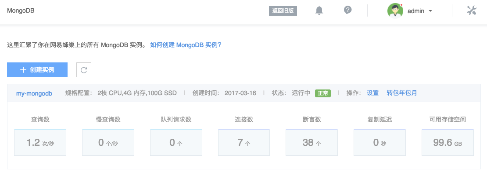

# 性能监控

## 1. Dashboard

你可以在 MongoDB 列表页，查看到各实例的 Dashboard。点击对应监控项，即可进入该监控项对应的监控图表。

## 2. 性能监控

Note:
支持自定义性能监控视图，详见 [性能监控视图管理](http://support.c.163.com/md.html#!平台服务/MongoDB/使用指南/监控与报警/MongoDB性能监控视图管理.md)。

➡ 登录 [控制台](https://c.163.com/dashboard#/m/mongodb/)，定位到目标实例
➡ 点击实例名称，进入「MongoDB」详情页
➡ 点击「性能监控」标签

该页面展示了当前实例各节点在系统资源、数据库资源、性能、复制和日志层面的五大类共计三十种性能数据，提供三项统计指标供选择，并基于用户指定的时间范围，提供不同聚合区间。并支持切换节点、监控视图。

### 2.1. 监控项

|    类型    |                                                                                                                                                                                                                                                                                                                                                                                               监控项                                                                                                                                                                                                                                                                                                                                                                                                |
|------------|-----------------------------------------------------------------------------------------------------------------------------------------------------------------------------------------------------------------------------------------------------------------------------------------------------------------------------------------------------------------------------------------------------------------------------------------------------------------------------------------------------------------------------------------------------------------------------------------------------------------------------------------------------------------------------------------------------------------------------------------------------------------------------------------------------|
| 系统资源   | CPU 利用率、内存利用率、IO 利用率、数据盘空间利用率、系统盘空间利用率、内存使用量、可用存储空间、数据盘空间使用量、数据盘读写次数、数据盘读写字节数、数据盘读写延迟、网络带宽                                                                                                                                                                                                                                                                                                                                                                                                                                                                                                                                                                                                                       |
| 数据库资源 | 连接数（用户连接数相关监控，包括用户当前使用的连接数和用户可用的连接数） 待处理请求队列（当前因为锁产生的操作队列长度，具体监控项包括等待读锁的操作数和等待写锁的操作数） 并发请求数（当前 wiredTiger 存储引挚的并发读写信息） 游标（服务器端游标相关监控，包括当前打开游标个数和超时游标个数） 文档个数（除 local 库外当前数据库所有表共有多少条记录） 文档数据量（除 local 库外当前数据库所有数据的总大小） 文档存储空间大小（除 local 库外当前数据库所有数据占的磁盘总大小） 索引个数（除 local 库外索引数总和） 索引大小（除 local 库外索引总大小） 内存访页缺失次数（数据库访问数据时发现数据不在内存时的页面数量，当数据库性能很差或者数据量极大时，这个值会显著上升） 存储引擎缓存（wiredTiger 存储引擎缓存相关监控项，主要包括缓存大小、缓存中实际数据量和缓存中脏数据量） |
| 性能       | CRUD、慢查询数、活跃客户端                                                                                                                                                                                                                                                                                                                                                                                                                                                                                                                                                                                                                                                                                                                                                                          |
| 复制       | 复制延迟、复制时间窗、headRoom                                                                                                                                                                                                                                                                                                                                                                                                                                                                                                                                                                                                                                                                                                                                                                      |
| 日志       | 断言                                                                                                                                                                                                                                                                                                                                                                                                                                                                                                                                                                                                                                                                                                                                                                                                    |

### 2.2. 时间范围与聚合区间

蜂巢提供过去 3 小时、24 小时、48 小时和 7 天等时间范围快捷按钮，点击即可查看相应时间范围内的监控数据。同时蜂巢支持自定义时间范围，点击「自定义」，即可设定任意时间范围查看相应时段的监控数据。根据时间范围大小，系统提供不同聚合区间供选择，具体对应如下表：

|         时间范围        |           可选聚合区间          |
|-------------------------|---------------------------------|
| 时间范围 ＜ 1 天        | 1 分钟、5 分钟、15 分钟、1 小时 |
| 1 天 ≤ 时间范围 ＜ 2 天 | 15 分钟、1 小时、6 小时         |
| 2 天 ≤ 时间范围 ＜ 7 天 | 1 小时、6 小时、1 天            |
| 7 天 ≤ 时间范围         | 6 小时、1 天                    |

### 2.3. 统计指标

系统提供三种性能监控统计指标：最大值、最小值、平均值。点击统计指标选择框可调整监控数据的统计指标。

