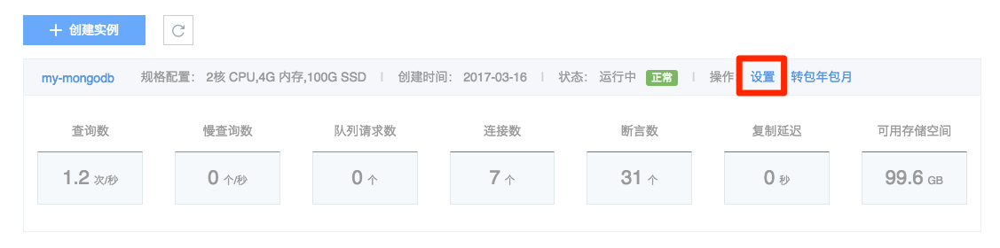

# 变更配置

Attention:
包年包月实例暂不支持变更配置；
变更配置将引起费用变化，收费标准详见价格与计费;
升级过程中可能会出现 30 秒内的闪断，主备可能发生切换；
缩小存储空间时，请留意数据盘空间利用率。

## 按量付费实例变更配置

➡ 登录 [控制台](https://c.163.com/dashboard#/m/mongodb/)
➡ 在侧边栏点击「MongoDB」标签
➡ 定位目标实例
➡ 在其右侧操作栏，点击「设置」

➡ 选择所需规格、存储空间
➡ 提交设置

Note:
修改规格后，cacheSizeGB 参数也会调整，支持手动修改；
修改存储空间后，oplogSizeMB 参数也会调整，支持手动修改。