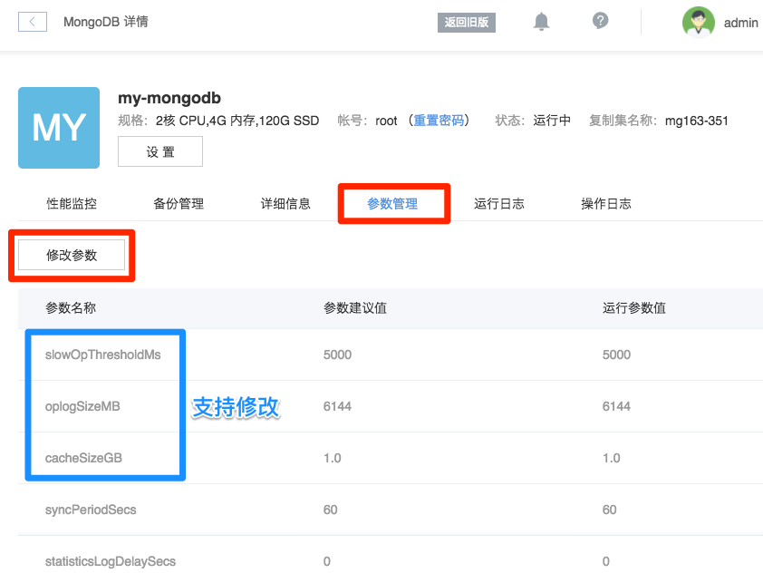

# 管理参数

蜂巢 MongoDB 实例创建时已优化配置文件。支持查看和修改部分配置文件参数，并提供参数建议值。

➡ 登录 [控制台](https://c.163.com/dashboard#/m/mongodb/)，定位到目标实例
➡ 点击实例名称，进入「MongoDB」详情页
➡ 点击「参数管理」标签，即可查看参数

➡ 点击「修改按钮」即可修改以下参数：

* slowOpThresholdMs
* oplogSizeMB（也支持在 [变更存储空间配置](http://support.c.163.com/md.html#!平台服务/MongoDB/使用指南/管理实例/MongoDB变更配置.md) 时修改）
* cacheSizeGB（也支持在 [变更规格配置](http://support.c.163.com/md.html#!平台服务/MongoDB/使用指南/管理实例/MongoDB变更配置.md) 时修改）

关于参数的说明，详见：[Configuration File Options](https://docs.mongodb.com/manual/reference/configuration-options/)。