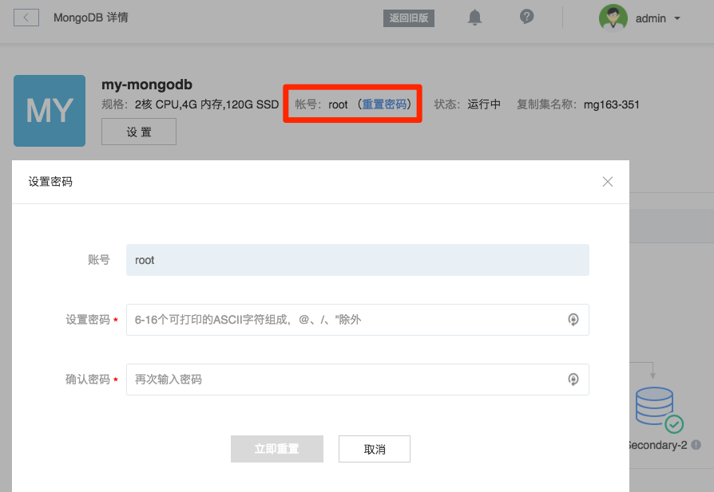

# 重置密码

若未创建账号，请先 [创建账号](http://support.c.163.com/md.html#!平台服务/MongoDB/使用指南/管理账号/MongoDB创建账号.md)。
若遗忘密码或需要更改密码，你可以重置实例 root 账号的密码。

➡ 登录 [控制台](https://c.163.com/dashboard#/m/mongodb/)，定位到目标实例
➡ 点击实例名称，进入「MongoDB」详情页
➡ 找到「账号」一栏，点击「重置密码」

