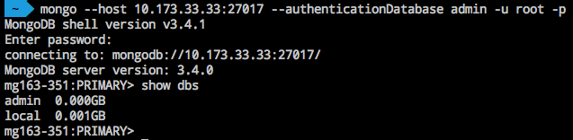

# mongo shell 连接

Note:
1. 请使用 mongo shell 3.0 及以上的版本； 2. 蜂巢 MongoDB 为私网实例，你可以从本账号内的容器或云主机等其他服务访问 MongoDB；在本地通过连接 VPN 访问蜂巢 MongoDB，操作指南请参见 [如何使用蜂巢 OpenVPN](http://support.c.163.com/md.html#!容器服务/服务管理/使用技巧/如何使用蜂巢 OpenVPN.md)。

[获取连接信息](http://support.c.163.com/md.html#!平台服务/MongoDB/使用指南/连接实例/MongoDB获取连接信息.md) 后，直接使用我们提供的 mongo shell 连接，例如：

	mongo --host 10.173.33.33:27017 --authenticationDatabase admin -u root -p

关于该命令的详细说明请参见：[mongo 命令官方文档](https://docs.mongodb.com/manual/reference/program/mongo/) 。

