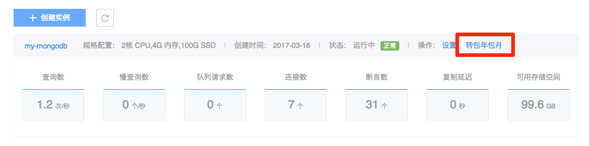

# 转换计费方式

MongoDB 支持包年包月和按量付费两种计费方式。你可以通过以下方式将按量付费实例转换为包年包月，或将包年包月转换为按量付费实例。

## 1. 按量付费实例转包年包月

➡ 登录 [控制台](https://c.163.com/dashboard#/m/mongodb/)
➡ 在侧边栏点击「MongoDB」标签
➡ 定位目标实例
➡ 在其右侧，点击「转包年包月」
➡ 选择「购买时长」
➡ 点击「立即购买」完成支付

## 2. 包年包月实例转按量付费

包年包月实例到期后未续费，将会自动转为按量付费的方式进行计费。