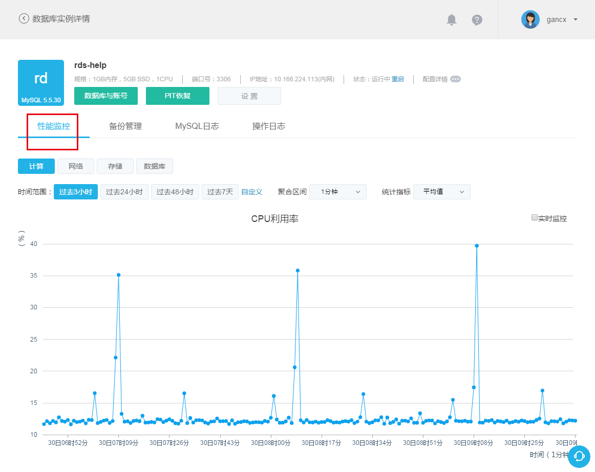
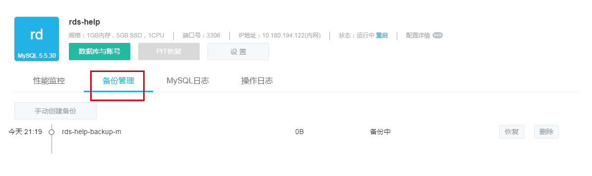

# RDS 实例管理

## 性能监控

在实例详情界面，点击「性能监控」标签进入到 RDS 实例性能监控界面。该页面展示了当前实例在计算、网络、存储和数据库层面的四大类共计三十种性能数据，提供五项统计指标供选择，并基于用户指定的时间范围，提供不同聚合区间和实时监控功能。 

**监控项**
本页面提供三十项监控数据的曲线图展示，详情如下：

| 类型	|监控项|
|--------------|----|
|计算	|CPU 利用率、内存利用率、系统盘利用率、占用内存量|
|网络	|网络流出带宽、网络流入带宽|
|存储	|磁盘空间利用率、磁盘 IO、磁盘利用率、占用磁盘存储空间、磁盘写入次数、磁盘读取次数、磁盘写入字节数、磁盘读取字节数、磁盘写入延时、磁盘读取延时|
|数据库	|数据库连接数、活跃连接数、查询操作数、插入操作频次、更新操作频次、删除操作频次、每秒查询数、慢查询数量、一般事务提交操作频次、二阶段事务提交操作频次、BufferPool 命中率、组提交比率、SecondBehindMaster、刷盘次数、binlog 文件大小|

**时间范围与聚合区间**

蜂巢提供过去 3 小时、24 小时、48 小时和 7 天等时间范围快捷按钮，点击即可查看相应时间范围内的监控数据。同时蜂巢支持自定义时间范围，点击「自定义」，即可设定任意时间范围查看相应时段的监控数据。根据时间范围大小，系统提供不同聚合区间供选择，具体对应如下表：

|时间范围|	可选聚合区间|
|--------------|----|
|时间范围 ＜ 1 天 |	1 分钟、5 分钟、15 分钟、1 小时|
|1 天 ≤ 时间范围 ＜ 2 天|	15 分钟、1 小时、6 小时|
|2 天 ≤ 时间范围 ＜ 7 天|	1 小时、6 小时、1 天|
|7 天 ≤ 时间范围	|6 小时、1 天|

**统计指标**

系统提供五种性能监控统计指标：总和、最大值、最小值、平均值和采样次数。点击统计指标选择框可调整监控数据的统计指标。

**实时监控*

在时间范围快捷按钮选定时间范围为「过去 3 小时」或「过去 24 小时」的场景下，蜂巢提供实时监控功能。勾选各性能监控数据曲线图右上角的实时监控，可开启或关闭该监控项的监控数据，并按指定聚合区间实时刷新。

**查看监控数据**

在性能监控数据曲线图中，将鼠标移至数据节点，可查看该点的详细监控数据和聚合时间戳，如下图所示：

