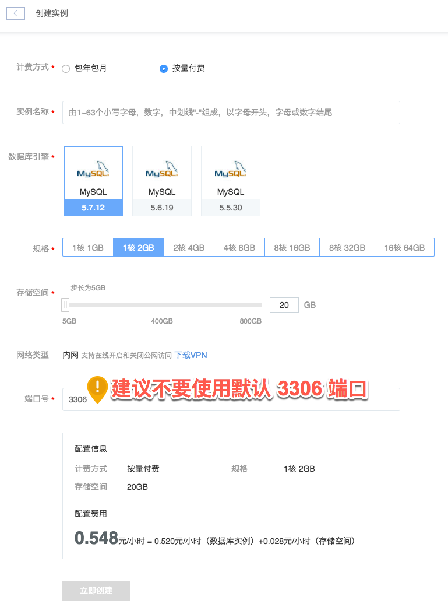

# 创建实例

RDS 有两种计费方式：包年包月和按量付费。建议你使用 [价格计算器](https://c.163.com/price#rds) 对实例的价格成本进行初步估算。
具体计费标准请参见 [RDS 价格与计费](http://http://support.c.163.com/md.html#!平台服务/RDS/购买指南/RDS价格与计费.md)。

## 操作步骤

1. 登录 [控制台](https://c.163.com/dashboard#/m/rds/)，定位到「**RDS**」标签；
2. 点击RDS列表左上角的「**创建实例**」按钮：

3. 选择相关配置，点击「**立即创建**」按钮，开始创建后你可以在 [操作日志](../md.html#!平台服务/RDS/使用指南/日志/RDS操作日志.md) 中看到实例创建日志。

Note:
出于安全考虑，建议不要使用默认 3306 端口，不开启公网；
默认不开启公网，可以通过蜂巢 OpenVPN 登录实例；
创建完成后可以在线开启和关闭公网。

## 相关 API

[API 手册 - 创建实例](../md.html#!平台服务/RDS/API手册/创建RDS实例.md)