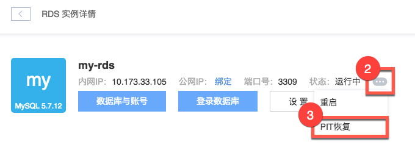
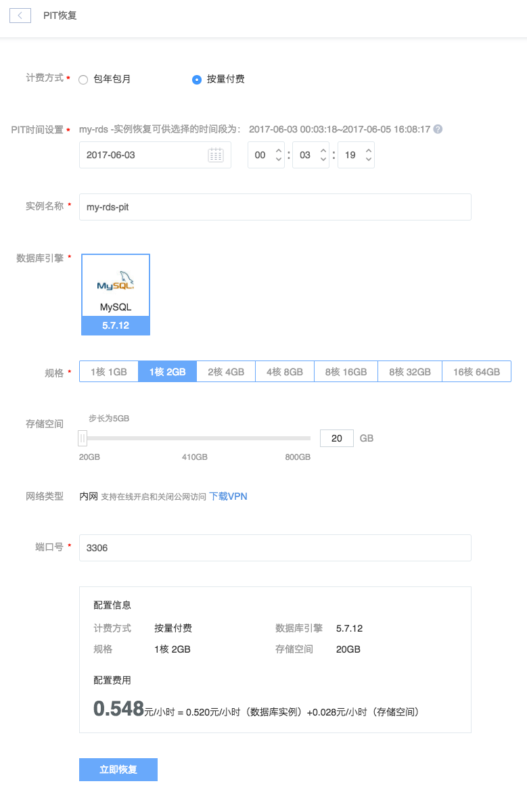

# PIT 恢复

PIT恢复基于实例增量备份机制，用于将实例的数据恢复到拥有增量备份的时间段内任意时间点的一致性状态。

Attention:
1.只有使用「增量备份」的实例才支持 PIT 恢复，你可以在 [设置实例](../md.html#!平台服务/RDS/使用指南/实例/设置RDS实例.md) 时，将备份策略修改为增量备份。
2.恢复完成后，将创建一个包含该备份数据的新 RDS 实例；
3.请确保选择的时间点在可供选择的时间段内；
4.请确保选择的时间点所对应的备份没有进行恢复实例操作。

## 使用场景

PIT 恢复能克隆出一个过去某时间点的实例，有效减少误操作的代价。

## 操作步骤

1. 登录 [控制台](https://c.163.com/dashboard#/m/rds/)，定位目标实例，点击「**实例名称**」；

2. 在实例详情页，点击实例状态右侧「」按钮；
3. 在弹出的菜单中点击「**PIT 恢复**」按钮： 

4. 选择相关配置，点击「**立即恢复**」按钮：

Note:
出于安全考虑，建议不要使用默认 3306 端口，不开启公网；
默认不开启公网，可以通过蜂巢 OpenVPN 登录实例；
创建完成后可以在线开启和关闭公网。

