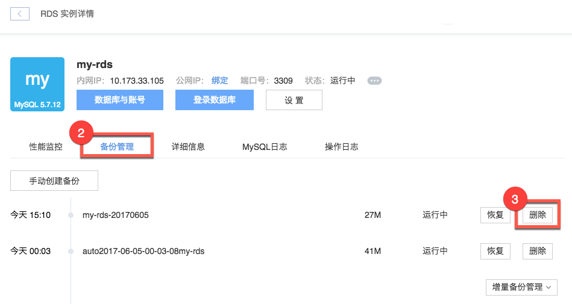

# 删除备份

Note:
1.可以在 [设置实例](../md.html#!平台服务/RDS/使用指南/实例/设置RDS实例.md) 时，设置备份的最大保留数（默认 7 个）；
2.备份数据不占用用户磁盘空间。

## 操作步骤

1. 登录 [控制台](https://c.163.com/dashboard#/m/rds/)，定位目标实例，点击「**实例名称**」；

2. 在实例详情页，点击「**备份管理**」标签；
3. 定位到需要恢复的备份，点击右侧的「**删除**」按钮：
