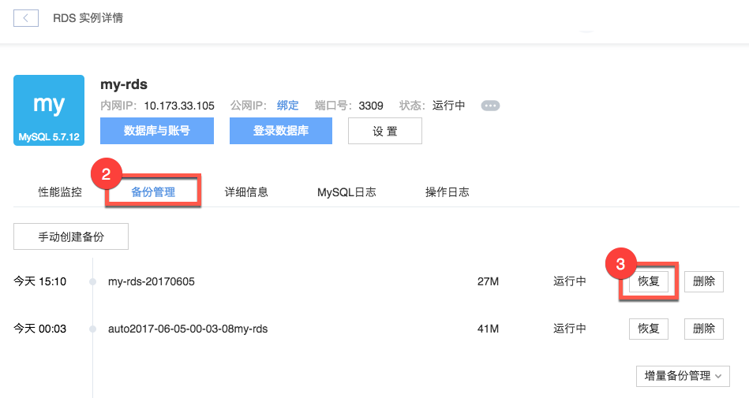
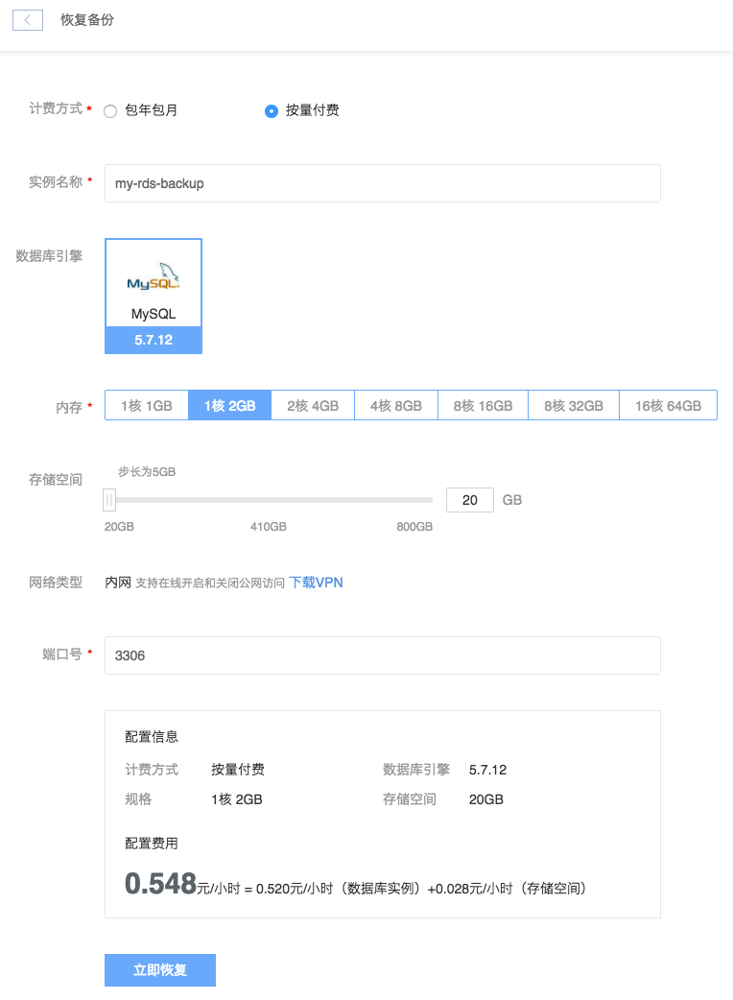

# 恢复数据（克隆实例）

Attention:
恢复完成后，将创建一个包含该备份数据的新 RDS 实例。

## 操作步骤

1. 登录 [控制台](https://c.163.com/dashboard#/m/rds/)，定位目标实例，点击「**实例名称**」；

2. 在实例详情页，点击「**备份管理**」标签；
3. 定位到需要恢复的备份，点击右侧的「**恢复**」按钮：

4. 选择相关配置，点击「**立即恢复**」按钮：

Note:
出于安全考虑，建议不要使用默认 3306 端口，不开启公网；
默认不开启公网，可以通过蜂巢 OpenVPN 登录实例；
创建完成后可以在线开启和关闭公网。