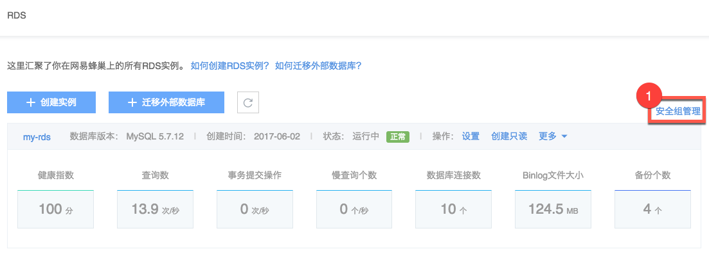
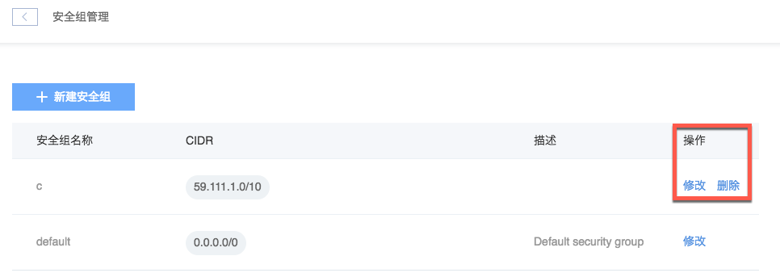

# 修改/删除安全组

Note:
默认安全组无法删除；
仅支持修改 CIDR。

## 操作步骤

1. 登录 [控制台](https://c.163.com/dashboard#/m/rds/)，点击「**RDS**」标签；
2. 在 RDS 列表右上角，点击「**安全组管理**」按钮；

3. 在安全组管理内，定位到目标安全组，点击右侧操作列的「**修改**」或「**删除**」按钮：
