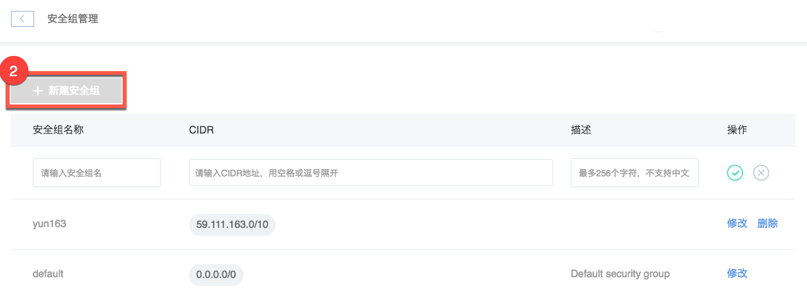

# 创建安全组

Note:
1.创建安全组之后，需要将实例和安全组的关系进行绑定，绑定后安全组方能生效。绑定实例和安全组，可在 [修改实例](../md.html#!平台服务/RDS/使用指南/实例/创建RDS实例.md) 时进行；
2.IP 白名单与实例安全组的交集为最终生效值。

## 使用场景
当需要对 RDS 实例做更精确的网络隔离时，需要使用安全组功能。你可以通过设置实例的安全组，来保证只有特定的 IP 地址能访问 RDS 实例，这样可以最大限度的保证用户数据库的网络安全性。

## 操作步骤

1. 登录 [控制台](https://c.163.com/dashboard#/m/rds/)，点击「**RDS**」标签；
2. 在 RDS 列表右上角，点击「**安全组管理**」按钮；

3. 在安全组管理内，点击「**新建安全组**」按钮：

### 安全组名称
由字母，数字、中划线组成、字母开头，字母或数字结尾，最长 100 个字符。

### CIDR
CIDR 是一个形如 `59.111.163.0/10` 的 IP 段，多个地址用空格或逗号隔开。关于 CIDR 可以参考 [Wikipedia：CIDR](https://zh.wikipedia.org/wiki/%E6%97%A0%E7%B1%BB%E5%88%AB%E5%9F%9F%E9%97%B4%E8%B7%AF%E7%94%B1)。

Attention:
默认 0.0.0.0/0 为允许任何 IP 访问。

### （选填）描述
最多 256 个字符，不支持中文。

