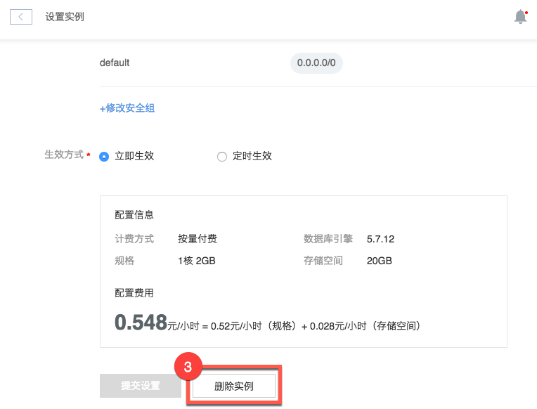

# 删除实例

Attention:
删除实例后，实例包含的只读实例及实例备份将同时被删除且不可恢复。

## 操作步骤

1. 登录 [控制台](https://c.163.com/dashboard#/m/rds/)，定位目标实例；
2. 在右侧 「**操作**」 列中，点击「**设置**」：

3. 在设置实例页面，点击底部的「**删除实例**」按钮：

## 相关 API

[API 手册 - 删除实例](../md.html#!平台服务/RDS/API手册/创建RDS实例.md)