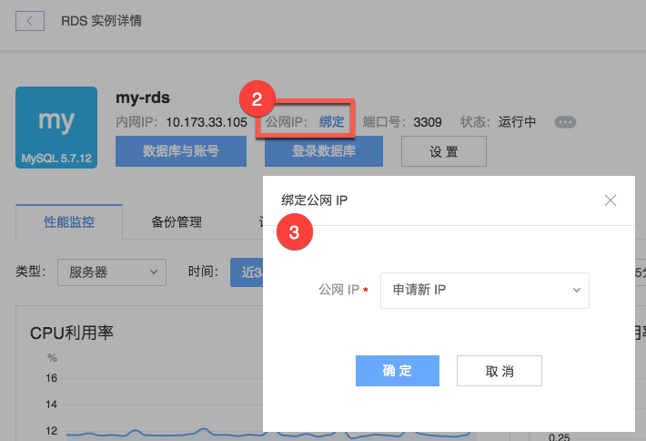
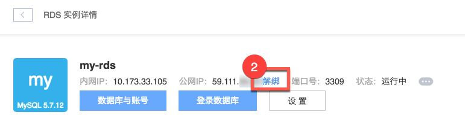

# 绑定/解绑公网 IP

Attention:
出于安全考虑如非迫切需要，请勿开启 RDS 公网。
你可以直接从本账号内的容器或云主机等其他服务访问 RDS；在其他环境你可以连接 [蜂巢 OpenVPN](../md.html#!计算服务/容器服务/使用技巧/如何使用蜂巢 OpenVPN.md) 后，使用内网 IP 连接实例。

## 绑定公网 IP

1. 登录 [控制台](https://c.163.com/dashboard#/m/rds/)，定位目标实例，点击「**实例名称**」；

2. 在实例详情页，点击公网 IP 后的「**绑定**」按钮；
3. 选择已申请的公网 IP 或申请新 IP，点击确定即可：

## 解绑公网 IP
1. 登录 [控制台](https://c.163.com/dashboard#/m/rds/)，定位目标实例，点击「**实例名称**」；

2. 在实例详情页，点击公网 IP 后的「**解绑**」按钮：
