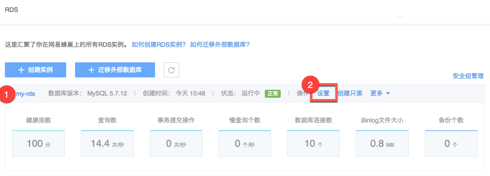
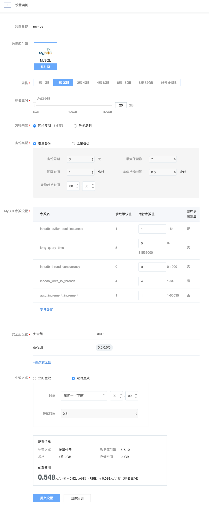

# 设置实例

Attention:
变更规格期间，可能会出现一次 30 秒内的闪断。建议在业务低峰时进行变配操作，或确保你的应用有自动重连机制，以避免闪断造成的影响；
修改参数可能需要重启实例，详见下方说明；
缩小存储空间时，请留意数据盘空间利用率。

Note:
数据库引擎不可修改；
包年包月实例不支持修改规格、存储空间；
变更配置可能将引起费用变化，收费标准详见价格与计费。

## 使用场景

* 变更配置（CPU、内存、数据盘存储空间）
* 修改数据集复制方式（同步复制、异步复制）
* 修改备份方式（增量备份、全量备份）
* 修改 MySQL 参数
* 修改安全组

## 操作步骤

1. 登录 [控制台](https://c.163.com/dashboard#/m/rds/)，定位目标实例；
2. 在右侧 「**操作**」 列中，点击「**设置**」：

3. 按需修改设置，点击「**提交设置**」

### 规格
变更规格期间将切换主备，可能会出现一次 30 秒内的闪断。建议在业务低峰时进行变配操作，或确保你的应用有自动重连机制，以避免闪断造成的影响；

### 存储空间
缩小存储空间时，请留意数据盘空间利用率。

### 复制类型
主从复制类型，推荐「同步复制」。

### 备份类型
* 增量备份：
	* 备份周期：备份间隔天数；
	* 最大保留数：备份最大保留数默认 7 个；
	* 间隔时间：增量备份间隔时间；
	* 备份持续时间：若备份失败，我们将在该持续时间内一直重试，直到成功；
	* 备份起始时间：备份开始时间。
* **全量备份（默认）**
	* 参数同增量备份。

### MySQL 参数设置
提供参数取值范围；部分参数修改后需要重启实例，请提前做好应对。

### 安全组设置
绑定实例和安全组，默认 0.0.0.0/0 为允许任何 IP 访问。安全组的说明详见：[安全组管理](../md.html#!平台服务/RDS/使用指南/安全组/创建RDS安全组.md)。

### 生效方式
支持立即生效和定时生效；
定时生效的持续时间（单位小时）是指若修改失败，则在该时间范围内继续重试，直至成功。

