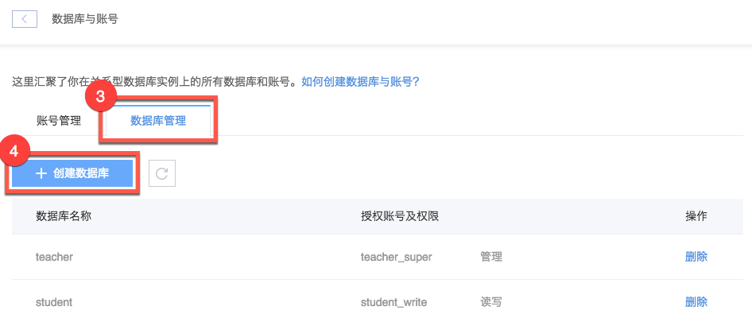
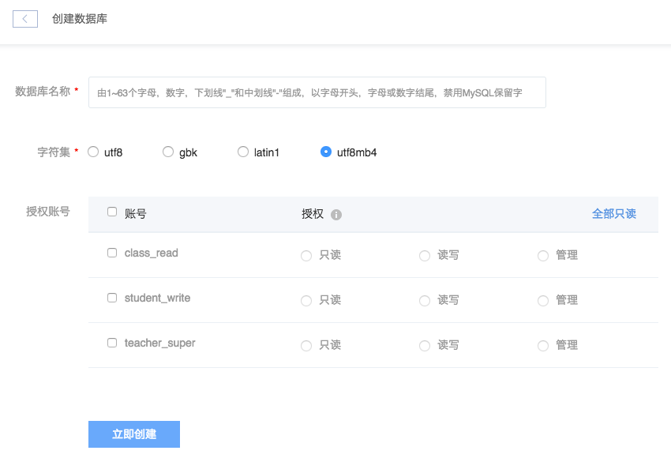

# 创建数据库

## 操作步骤

1. 登录 [控制台](https://c.163.com/dashboard#/m/rds/)，定位目标实例，点击「**实例名称**」；

2. 在实例详情页，点击「**数据库与账号**」按钮：

3. 在数据与账号页面，点击「**数据库管理**」标签；
4. 点击「**创建数据库**」按钮：

5. 按需填写内容，点击「**立即创建**」按钮：

### 数据库名称
由 1~63 个字母，数字，下划线"_"和中划线"-"组成，以字母开头，字母或数字结尾，禁用 MySQL 保留字

### 字符集
支持：utf8、gbk、latin1、utf8mb4

### 授权账号
为创建账号可为空，权限说明：
* 只读：查询条件
* 读写：查询、修改、删除和插入权限
* 管理：读写权限，同时对表、触发器、存储过程和视图等具有操作权限

建议使用最低权限原则，即满足用户或应用所需的最小权限。

## 相关 API

[API 手册 - 创建数据库](../md.html#!平台服务/RDS/API手册/创建数据库.md)