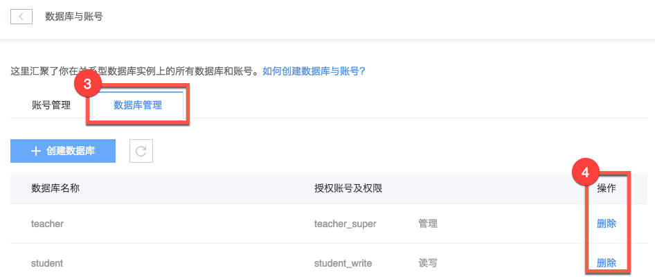

# 删除数据库

Note:
不要使用客户端或 SQL 删除数据库。

## 操作步骤

1. 登录 [控制台](https://c.163.com/dashboard#/m/rds/)，定位目标实例，点击「**实例名称**」；

2. 在实例详情页，点击「**数据库与账号**」按钮：

3. 在数据与账号页面，点击「**数据库管理**」标签；
4. 定位到目标数据库，点击右侧操作列的「**删除**」按钮：

## 相关 API

[API 手册 - 删除数据库](../md.html#!平台服务/RDS/API手册/删除数据库.md)