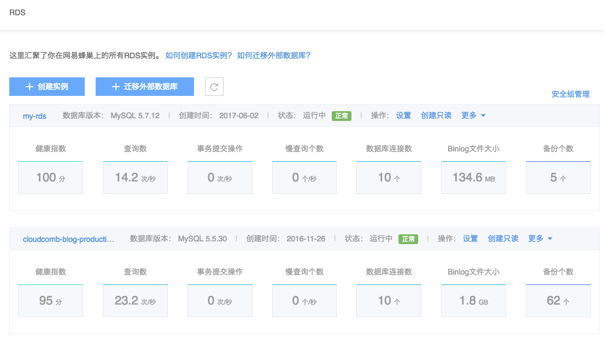
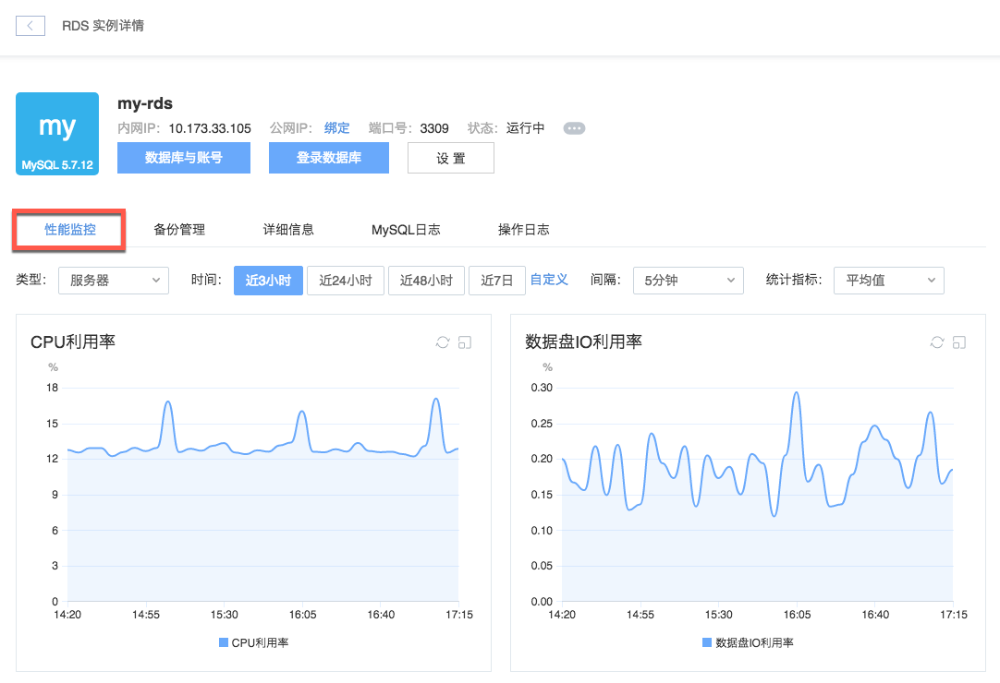

# 性能监控

## Dashboard

你可以在 RDS 列表页，查看到各实例的 Dashboard：

## 性能监控

### 操作步骤

1. 登录 [控制台](https://c.163.com/dashboard#/m/rds/)，定位目标实例，点击「**实例名称**」；

2. 在实例详情页，点击「**性能监控**」标签：

该页面展示了当前实例在服务器和数据库层面的两大类共计三十种性能数据，提供三项统计指标供选择，并基于用户指定的时间范围，提供不同聚合区间的监控功能。 

#### 监控项
本页面提供三十项监控数据的曲线图展示，详情如下：

* **服务器**：CPU 利用率、内存利用率、内存使用量、数据盘 IO 利用率、数据盘空间使用量、系统盘空间利用率、数据盘空间利用率、数据盘读取次数、数据盘写入次数、数据盘读取字节数、数据盘写入字节数、数据盘读取延迟、数据盘写入延迟、网络流出带宽、网络流入带宽；
* **数据库**：总连接数、活跃连接数、查询操作、插入操作、更新操作、删除操作、每秒查询数、慢查询数、BufferPool 命中率、刷盘次数、一般事务提交操作、二阶段事务提交操作、组提交比率、SecondBehindMaster、Binlog 文件大小。

#### 时间范围与聚合区间

提供过去 3 小时、24 小时、48 小时和 7 天等时间范围快捷按钮，点击即可查看相应时间范围内的监控数据。
支持自定义时间范围，点击「自定义」，即可设定任意时间范围查看相应时段的监控数据。
根据时间范围大小，系统提供不同聚合区间供选择，具体对应如下表：

|         时间范围        |           可选聚合区间          |
|-------------------------|---------------------------------|
| 时间范围 ＜ 1 天        | 1 分钟、5 分钟、15 分钟、1 小时 |
| 1 天 ≤ 时间范围 ＜ 2 天 | 15 分钟、1 小时、6 小时         |
| 2 天 ≤ 时间范围 ＜ 7 天 | 1 小时、6 小时、1 天            |
| 7 天 ≤ 时间范围         | 6 小时、1 天                    |

#### 统计指标

系统提供三种性能监控统计指标：最大值、最小值、平均值。点击统计指标选择框可调整监控数据的统计指标。

