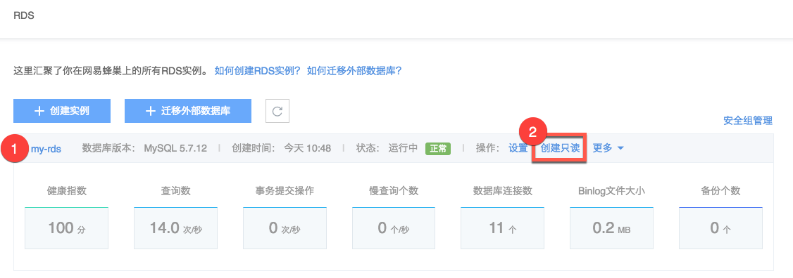
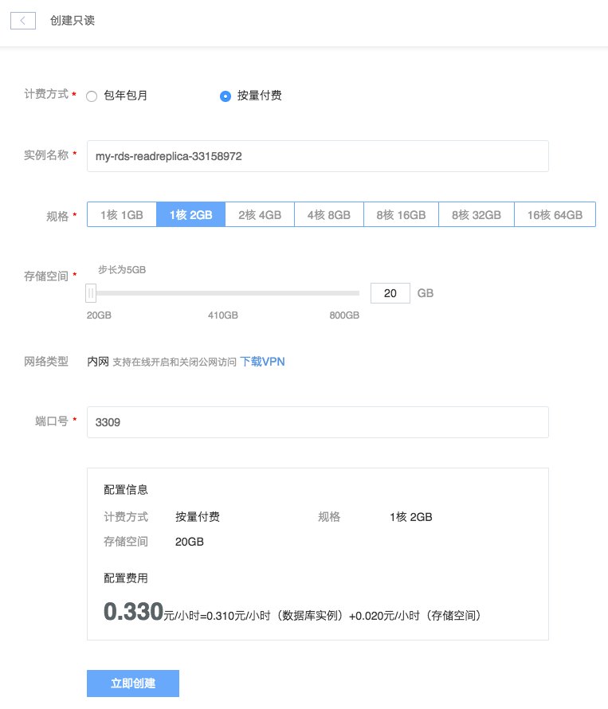

# 创建只读实例

Note:
计费方式：支持包年包月和按量付费；
备份：不支持备份；
安全组：支持独立安全组配置；
账号与数据库：与源实例同步；
配置：可变配，支持弹性升降级；
提升角色：支持将只读实例提升为普通实例；
其他 RDS 生命周期管理同普通实例。

## 使用场景

在数据库仅有少量写请求，但有海量读请求的应用场景下，单个实例可能无法承载读取压力，导致对业务产生影响。利用可弹性扩展的只读实例，满足读取需求，增加应用吞吐量。

## 操作步骤

1. 登录 [控制台](https://c.163.com/dashboard#/m/rds/)，定位目标实例；
2. 在右侧 「**操作**」 列中，点击「**创建只读**」：

3. 选择相关配置，点击「**立即创建**」按钮，开始创建后你可以在 [操作日志](../md.html#!平台服务/RDS/使用指南/日志/RDS操作日志.md) 中看到实例创建日志。

说明：
* 计费方式：只读实例支持包年包月和按量计费，[RDS 价格与计费](../md.html#!平台服务/RDS/购买指南/RDS价格与计费.md)；
* 规格：默认使用源实例配置，可以按需修改，支持变配；
* 安全组：支持独立安全组配置；