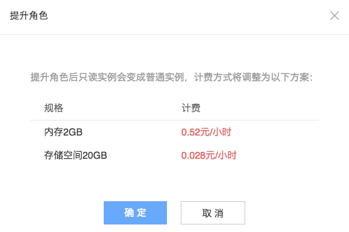

# 提升角色（将只读实例提升为普通实例）

Note:
1.只读实例价格远低于普通实例，提升角色后将产生费用变化，详见：[RDS 价格与计费](../md.html#!平台服务/RDS/购买指南/RDS价格与计费.md)；
2.提升角色不会对源实例造成影响。

## 操作步骤

1. 登录 [控制台](https://c.163.com/dashboard#/m/rds/)，定位目标只读实例；
2. 在右侧 「**操作**」 列中，点击「**提交角色**」：

3. 在弹出的对话框中，确认费用情况（只读实例价格远低于普通实例），点击「**确定**」按钮：
