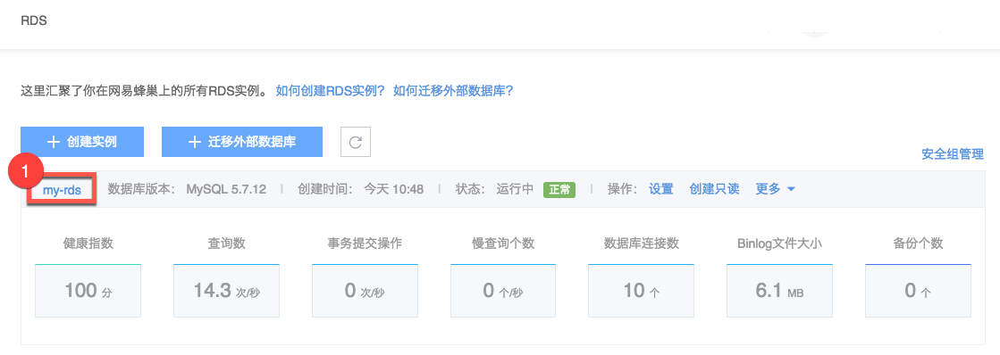
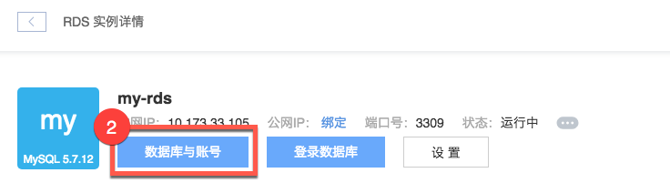
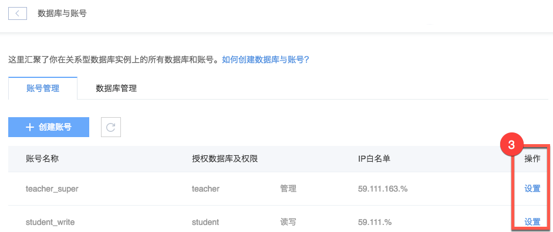
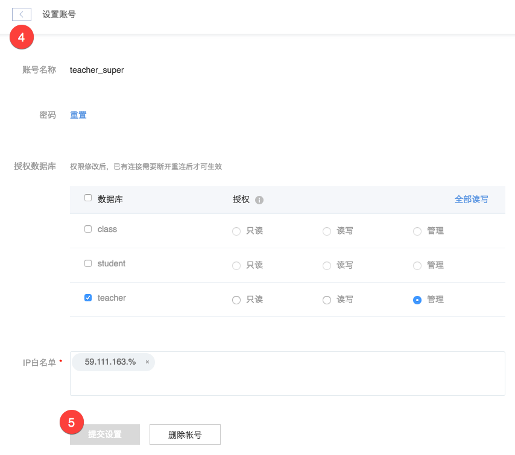

# 修改权限

Note:
IP 白名单与实例安全组的交集为最终生效值；
修改权限时，建议使用最低权限原则，即满足用户或应用所需的最小权限；
授权数据库权限修改后，已有连接需要断开重连后才可生效。

## 操作步骤

1. 登录 [控制台](https://c.163.com/dashboard#/m/rds/)，定位目标实例，点击「**实例名称**」；

2. 在实例详情页，点击「**数据库与账号**」按钮：

3. 在数据库与账号页面的账号管理标签下，点击右侧操作列的「**设置**」按钮：

4. 按需调整授权数据库和 IP 白名单：

## 相关 API

[API 手册 - 修改账号权限](../md.html#!平台服务/RDS/API手册/修改账号权限.md)