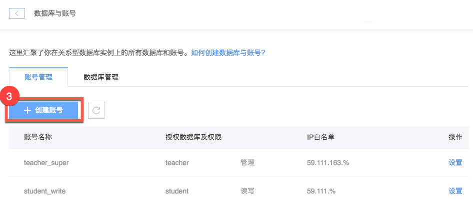

# 创建账号

Note:
创建账号时，建议使用最低权限原则，即满足用户或应用所需的最小权限。

## 操作步骤

1. 登录 [控制台](https://c.163.com/dashboard#/m/rds/)，定位目标实例，点击「**实例名称**」；

2. 在实例详情页，点击「**数据库与账号**」按钮：

3. 在数据与账号页面的账号管理标签下，点击「**创建账号**」按钮：

4. 按需填写内容，点击「**立即创建**」：

### 账号名称
由 1~16 个字母，数字，下划线"_"组成，以字母开头，字母或数字结尾，禁用MySQL保留字。

### 密码
由 6-16 个可打印的ASCII字符组成，@，/，"除外。

### 授权数据库
若未创建数据库可为空，权限说明：
* 只读：查询条件
* 读写：查询、修改、删除和插入权限
* 管理：读写权限，同时对表、触发器、存储过程和视图等具有操作权限

建议使用最低权限原则，即满足用户或应用所需的最小权限。

### IP 白名单
多个 IP 地址使用空格或都好隔开，通配符为 `%`。

## 相关 API

[API 手册 - 创建账号](../md.html#!平台服务/RDS/API手册/创建账号.md)