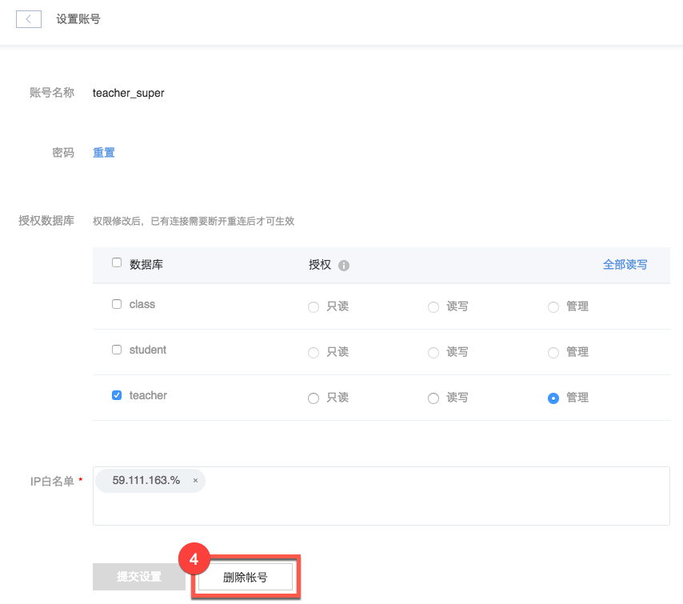

# 删除账号

## 操作步骤

1. 登录 [控制台](https://c.163.com/dashboard#/m/rds/)，定位目标实例，点击「**实例名称**」；

2. 在实例详情页，点击「**数据库与账号**」按钮：

3. 在数据库与账号页面的账号管理标签下，点击右侧操作列的「**设置**」按钮：

4. 点击页面底部的「**删除账号**」按钮：

## 相关 API

[API 手册 - 删除账号](../md.html#!平台服务/RDS/API手册/删除账号.md)