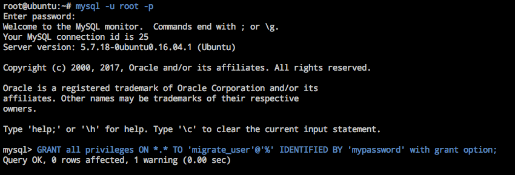
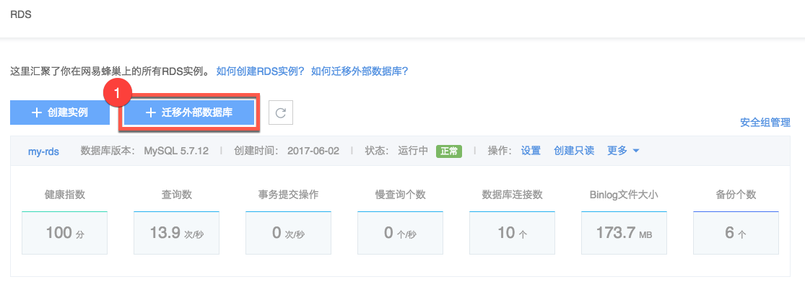
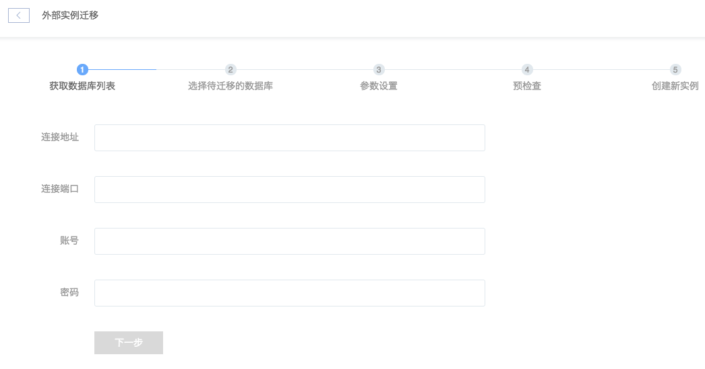
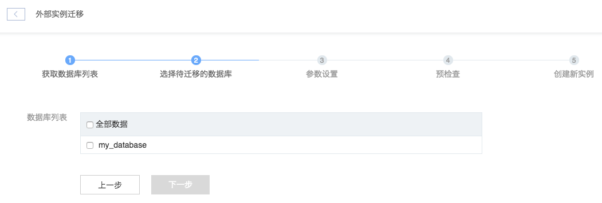
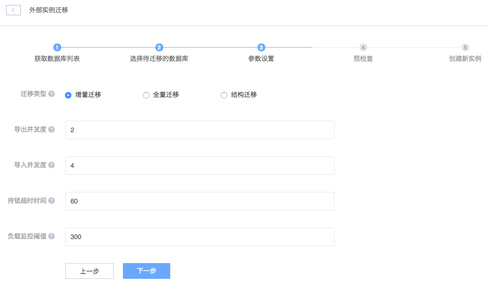
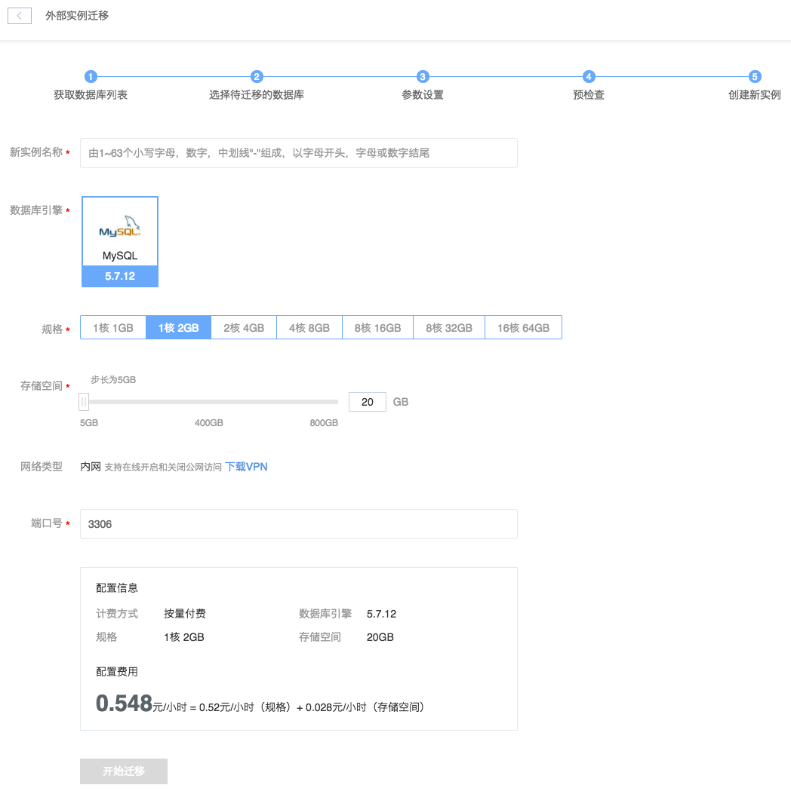

# 迁移外部数据库

蜂巢的外部数据库迁移功能支持多线程数据库备份和恢复，也支持基于业务负载的自适应迁移和迁移失败的重试。此外，蜂巢提供了较为全面的迁移参数检查，提高了迁移数据的成功率。

本文将以有公网 IP 的外部 MySQL 数据库实例迁移至蜂巢 RDS 为例（也适用于其他外部实例）。

## 1. 迁移限制

* 不会迁移源实例 mysql.user 表中的账号信息，请确保将业务切换到新实例前重新创建账号；
* 源实例 MySQL 版本须高于 5.1.41；
* 源实例 MySQL 版本在 5.5 以下时迁移可能失败，若遇到请 [提交工单](https://c.163.com/dashboard#/m/ticket/create/?type=%E6%95%B0%E6%8D%AE%E5%BA%93) 联系我们；
* 不支持迁移名称中包含 `;` 符号的数据库；
* 不支持迁移 MySQL 系统库，如 information_schema 、performance_schema、bak_database 或 data_dictionary、mysql、sys 等。

## 2. 迁移说明

* 账号
	* 在迁移结束后可以通过「数据库与账号」功能重新创建账号；
* 版本
	* 外部实例是 MySQL 5.5 及以下版本，将使用 RDS5.5.30 版本作为目标版本；
	* 外部实例是 MySQL 5.6 或 5.7 版本，将使用 RDS 5.7 版本作为目标版本；
* 权限
	* 源实例所需权限：SELECT 、LOCK TABLES 权限（导出一致性数据）、导出 SCHEMA 所需的相关权限、REPLICATION SLAVE、REPLICATION CLIENT（仅在增量迁移时）；
	* 若迁移账号有 mysql.user  表访问权限，则通过该表进行权限检查；若无，则通过 information_schema 系统库的 USER_PRIVILEGES 和 SCHEMA_PRIVILEGES 两张表来检查账号的权限；
	* 若使用 **增量迁移**，请确认源实例已开启 binlog 并设置 server_id（目前 server_id 不能设置为 0 或 1）；
* 其他
	* 若迁移账号 SUPER 权限，则在导出外部实例数据阶段，会临时修改外部实例 MySQL InnoDB 参数 innodb_old_blocks_time，完成数据导出或导出失败时，RDS 会自动将其设置回原值；
	* 若迁移账号有 RELOAD 权限，则使用 FTWRL（flush tables with read lock）来获取一致性数据点；若无，则通过 lock tables xx read 语法来获取一致性数据点；
	* 在将数据导入 RDS 实例阶段，RDS 实例的 sync-binlog、innodb_flush_log_at_trx_commit、log_slow_queries 参数均会进行临时优化，完成数据导入或导入失败时，会自动将其设置回原值。

## 3. 迁移流程

### 3.1. 创建迁移账号

我们强烈建议新建一个拥有相应权限的账号进行数据迁移。
登录 MySQL 客户端，使用如下命令创建账号并赋予权限：

    GRANT all privileges ON <数据库名>.<表名> TO '<期望创建的用户名>'@'<用户地址>' IDENTIFIED BY '<期望设置的密码>' with grant option;

    # 本示例中为 GRANT all privileges ON *.* TO 'migrate_user'@'%' IDENTIFIED BY 'mypassword' with grant option;

说明：

* 将 `<用户地址>`（即迁移账号的 Host 字段）设置为 `%`；
* 方便起见，本例中直接赋予数据库所有表的全部权限：<code>GRANT all privileges ON \*.\*</code>
* **其他公有云 RDS 实例迁移**：需要迁移第三方 RDS 实例时，由于数据库账号权限管理的限制，无法自由地对迁移账号赋权，此时请确保所创建的账号有「**2.迁移说明**」中的权限即可。

Attention:
该账号拥有所有权限，出于安全考虑，数据迁移完成后，请删除该账号或直接删除本地数据库；

### 3.2. 获取数据库列表

3.2.1. 登录 [控制台](https://c.163.com/dashboard#/m/rds/)，定位到「**RDS**」标签，点击「**迁移外部数据库**」按钮：

3.2.2. 填写源实例（待迁移的外部数据库）信息：

### 3.3. 选择待迁移的数据库

支持一次性迁移同一实例内的多个数据库。

### 3.4. 参数设置

参数说明：
**迁移类型**

* 增量迁移（默认）：
增量迁移包括全量迁移和增量复制两个阶段。完成全量迁移后，会将迁移过程发生的数据变更同步到目标实例，如果迁移期间进行了 DDL 操作，那么这些结构变更不会迁移到目标实例。

* 全量迁移：
将源实例迁移对象的结果定义及数据全部迁移到目标实例。迁移过程中，为了保证数据一致性，非事务表会被锁定，锁定期间这些表无法写入，锁定时长依赖于这些表的数据量大小，在这些非事务表迁移完成后，锁才会释放。

* 结构迁移：
将源实例迁移对象（数据库、表）的结构定义（schema）迁移到目标实例。支持结构迁移的对象包括：表、视图、触发器、存储过程、存储函数等。

**导出并发度**

表示启用多少个线程来同时导出表中的数据。请合理选择数据导出线程数，系统默认为 2 个，建议刚开始使用暂先不超过 3 个。

**导入并发度**

表示启用多少个线程来同时导入表中的数据。RDS 的数据导入线程需要根据 RDS 本身的存储介质性能进行合理规划。系统默认为 2 个，蜂巢的经验表明：2 至 4 个线程一般来说已能够达到最大数据写入性能。

**持锁超时时间**

表示进行数据导出时，允许对源实例加读锁（通过执行 flush tables with read lock 获取读锁）的时长，单位为 s。注意，该值的设置会极大影响迁移，设小会导致迁移出错，设大的话需要关注是否对外部实例业务产生影响。

**负载监控阈值**

表示从源实例导出数据时，允许导出线程 select 数据的最大负载，通过 threads_running 数值来衡量，如果该参数超过阈值则数据导出暂停，降到阈值以下时再继续。系统默认的监控项为 300，如果外部实例压力较大，连接数较多，请合理选择监控项，并适当增加监控项。

### 3.5. 预检查

参数设置后，将自动进行参数预检查，包括实例连通性、各个参数设置是否正确等。
* 若发现错误，将出现未通过提示，将鼠标移动未通过右侧的感叹号可以查看到具体的解决建议，调整参数后点击「**重新检查**」；

* 若检查通过，则将进入下一步开始创建新实例。

### 3.6. 创建新实例

Note:
迁移过程中，可以通过 [操作日志](../md.html#!平台服务/RDS/使用指南/日志/RDS操作日志.md)，查看进度。

**数据库引擎**

外部实例是 MySQL 5.5 及以下版本，将使用 RDS5.5.30 版本作为目标版本；
外部实例是 MySQL 5.6 或 5.7 版本，将使用 RDS 5.7 版本作为目标版本。

**规格**
请注意选择满足之前业务需求的实例规格，创建完成后也支持变配。

**存储空间**
请确保迁移中创建的 RDS 实例有足够的空间用于迁移外部实例数据。

**端口号**
出于安全考虑，建议不要使用默认 3306 端口。