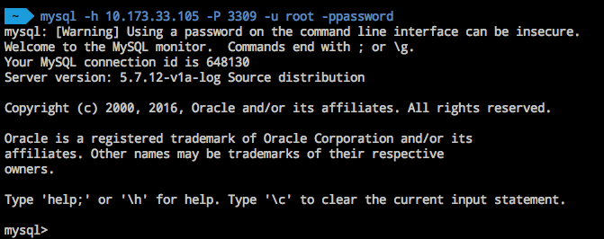

# MySQL 客户端连接 RDS

Note:
1.确保本地已安装 [MySQL 客户端](https://www.mysql.com/downloads/)；
2.未开启公网的实例，可以通过 [蜂巢 OpenVPN](../md.html#!计算服务/容器服务/使用技巧/如何使用蜂巢 OpenVPN.md) 登录实例；
3.没有账号，请先 [创建账号](../md.html#!平台服务/RDS/使用指南/账号/创建RDS账号.md)，并确保设置了正确的 [IP 白名单](../md.html#!平台服务/RDS/使用指南/账号/修改RDS账号权限.md)；
4.RDS 与原生的数据库服务完全兼容，其他客户端连接也可以参考本示例。

## 使用场景

本地已安装 MySQL 客户端，使用命令行方式连接 RDS，管理数据库。

## 操作步骤

使用如下命令连接 RDS：

	mysql -h <RDS IP> -P <RDS 端口号> -u <账号> -p<密码>
	# 本示例中为 mysql -h 10.173.33.105 -P 3309 -u root -ppassword

参数说明：

* **-h**：RDS 内网或公网 IP
* **-P**：大写 P，RDS 端口号。选填（默认 3306）
* **-u**：RDS 账号名称。没有账号，请先 [创建账号](../md.html#!平台服务/RDS/使用指南/账号/创建RDS账号.md)
* **-p**：小写 p，账号对应密码。注意：`-p` 与密码之间没有空格（不附带 `-p` 参数时，也将提示你输入密码）

更多帮助，详见：[MySQL Shell User Guide](https://dev.mysql.com/doc/mysql-shell-excerpt/5.7/en/)。