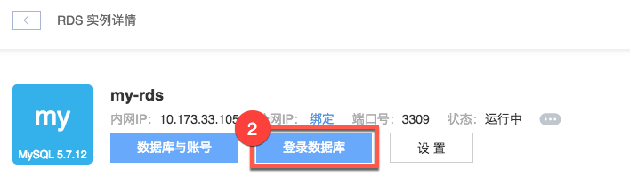
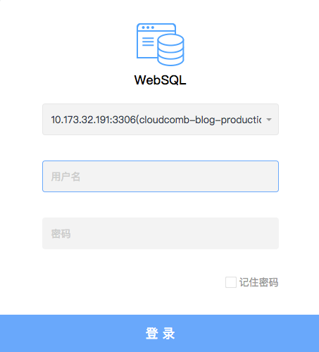
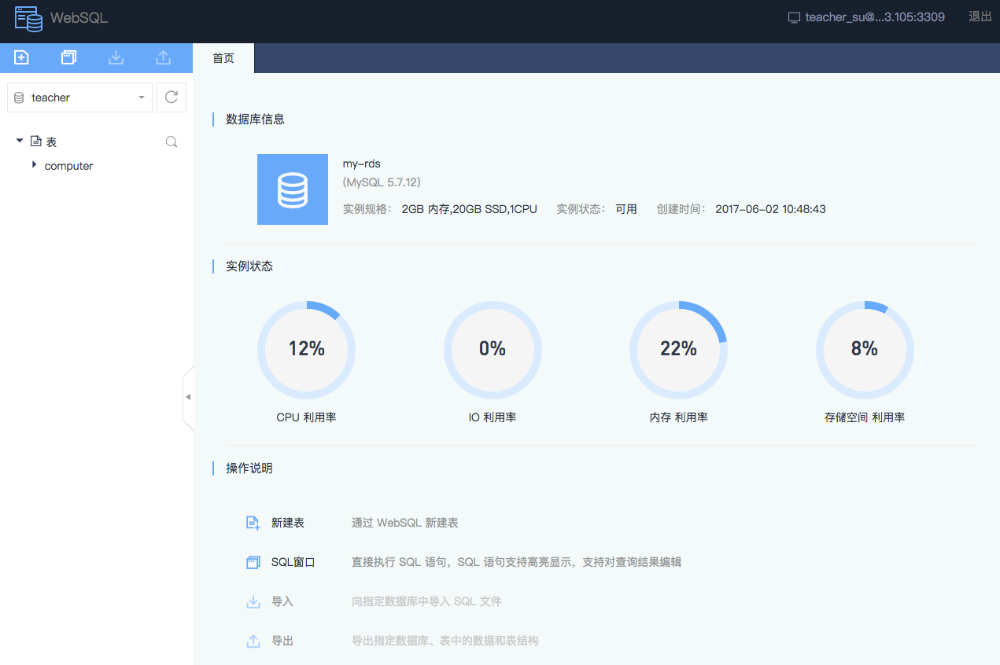

# WebSQL 连接 RDS

WebSQL 是网易蜂巢提供的 Web 版客户端。

Note:
部分功能陆续开放中，请以线上实际版本为准；
账号白名单和RDS 实例安全组不影响 WebSQL 登录；
使用完毕，建议点击 WebSQL 右上角的「**退出**」按钮，注销账号。

## 使用场景

利用蜂巢提供的 Web 版客户端，简单快速连接 RDS 实例，进行建表、执行 SQL 等操作。

## 操作步骤

1. 登录 [控制台](https://c.163.com/dashboard#/m/rds/)，定位目标实例，点击「**实例名称**」；

2. 在实例详情页，点击「**登录数据库**」按钮：

3. 输入用户名和密码（没有账号，请先 [创建账号](../md.html#!平台服务/RDS/使用指南/账号/创建RDS账号.md)，无需添加白名单），点击「**登录**」按钮：

4. 登录成功：
