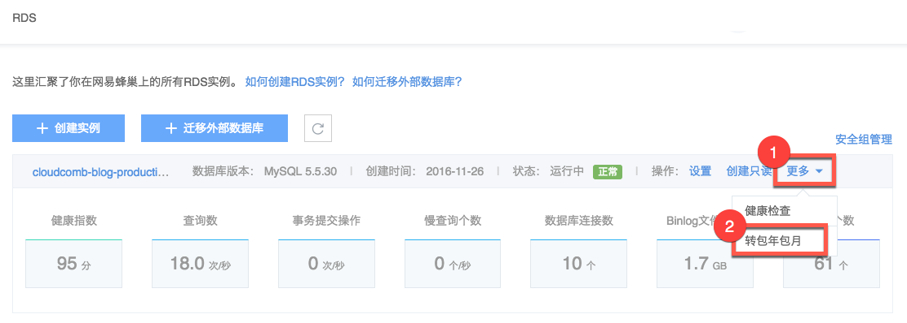
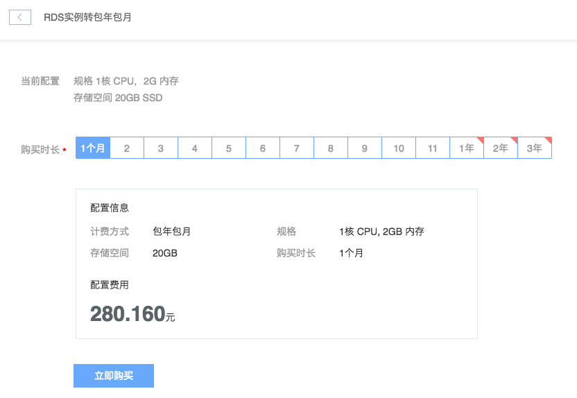

# 转换计费方式

RDS 支持包年包月和按量付费两种计费方式。你可以通过以下方式将按量付费实例转换为包年包月，或将包年包月转换为按量付费实例。

## 按量付费实例转包年包月

1. 登录 [控制台](https://c.163.com/dashboard#/m/rds/)，定位到目标实例；
2. 在右侧 「**操作**」 列中，点击「**更多**」➡「**转换包年包月**」：

3. 选择购买时长，点击「**立即购买**」，完成支付后生效：

## 包年包月实例转按量付费

包年包月实例到期后未续费，将会自动转为按量付费的方式进行计费，收费标准详见 [RDS 价格与计费](../md.html#!平台服务/RDS/购买指南/RDS价格与计费.md)。