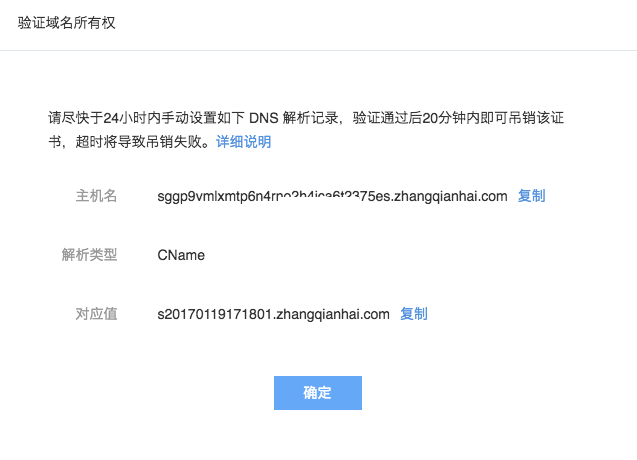

# 吊销 SSL 证书

点击左侧的导航菜单「SSL 证书管理」，进入 SSL 证书管理页面，找到需要吊销的证书，在右侧操作栏点击「吊销」按钮：

## 验证域名所有权

点击「吊销」按钮后，弹出验证域名所有权对话框：

证书状态为吊销中：

也可以在此查看域名所有权的验证方式。

Attention:
请尽快于 24 小时内手动设置如下 DNS 解析记录，验证通过后 20 分钟内即可吊销该证书，超时将导致吊销失败。

## 添加 DNS 解析记录

Attention:
解析类型必须为 TXT
申请域名以 www 开头或主域，如 www.163.com、163.com，则主机名填写 @
其他二级域名，如 c.163.com 则主机名填写 c。

吊销证书需要通过添加 DNS 解析来验证域名所有权。一般来说在你的域名供应商处都可以设置解析。

蜂巢域名系统添加解析方法详见：[如何设置解析](http://support.c.163.com/md.html#!网站服务/域名系统/使用指南/设置解析.md)，你根据提示内容依次输入主机名、解析类型、对应值即可。

