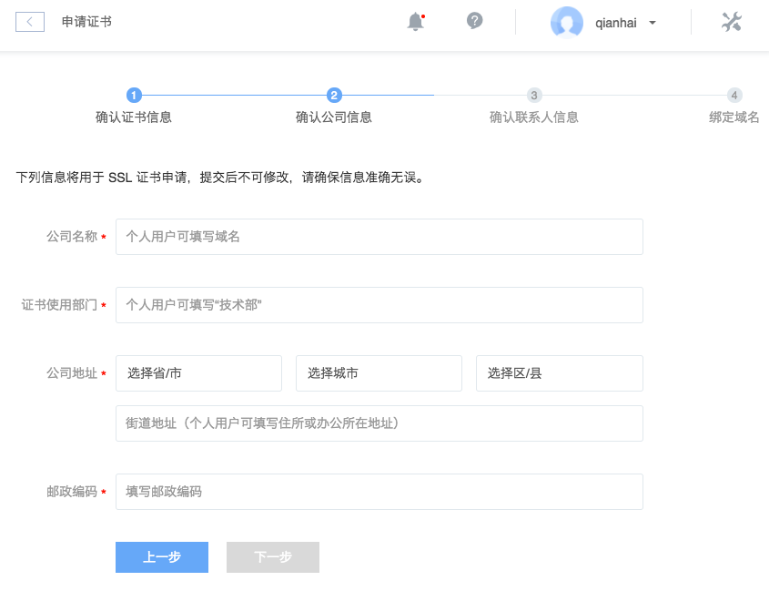
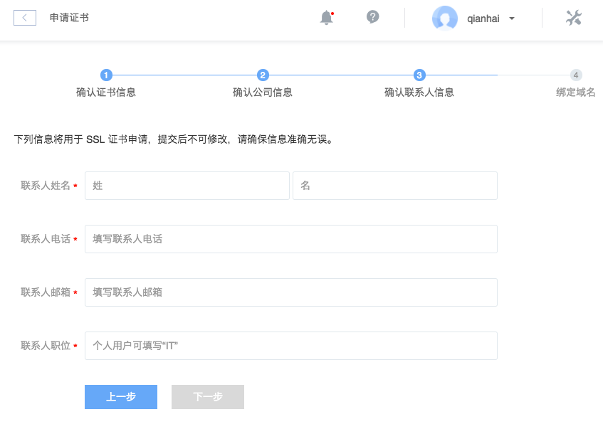
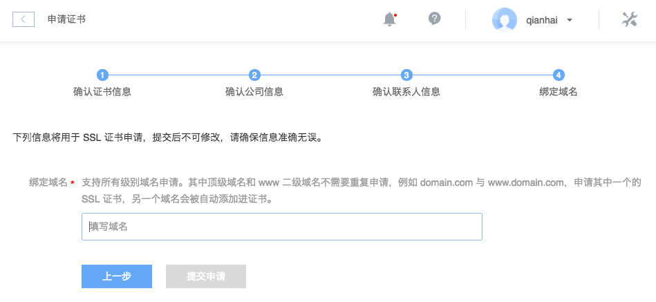
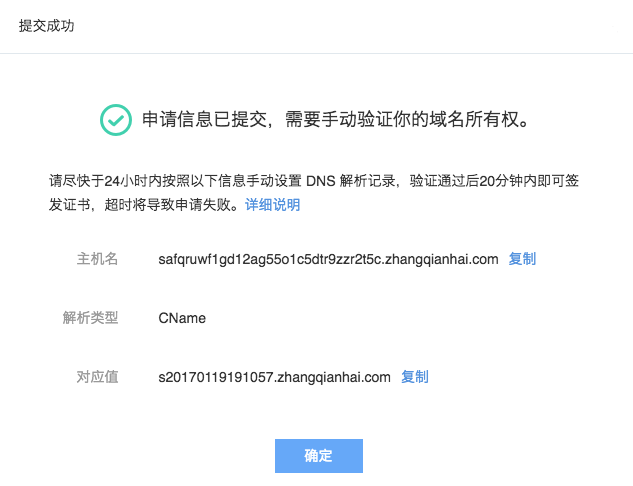

# 申请 SSL 证书

点击左侧的导航菜单「SSL 证书管理」，进入 SSL 证书管理页面，再点击「申请证书」按钮开始申请证书。

Note:
目前提供单域名普及版的 DV 证书，OV、EV 等企业证书即将上架，敬请期待。
若没有可用域名，可以在我们的 [域名系统](http://domain.c.163.com/) 购买。
请勿利用数字证书加密特点从事 Internet 上为国家法律、法规明令禁止的活动、发布色情的内容、钓鱼网站、进行违反国家规定的政治或宗教宣传、发布涉及国家机密和安全的信息、发布危害社会秩序和治安、社会公共道德和侵害他人合法权益的信息等。
DV 证书不支持下载，仅支持在蜂巢上部署。

## 确认证书信息
输入自定义的证书名称：

## 确认公司信息

## 确认联系人信息

## 绑定域名

Note:
支持所有级别域名申请。其中顶级域名和 www 二级域名不需要重复申请，例如 domain.com 与 www.domain.com，申请其中一个的 SSL 证书，另一个域名会被自动添加进证书。

 
## 验证域名所有权

点击「提交申请」按钮后，弹出验证域名所有权对话框：

证书状态为验证中：

也可以在此查看域名所有权的验证方式。

Attention:
请尽快于 24 小时内手动设置 DNS 解析记录，验证通过后 20 分钟内即可签发证书，超时将导致申请失败。

## 添加 DNS 解析记录

申请证书需要通过添加 DNS 解析来验证域名所有权。一般来说在你的域名供应商处都可以设置解析。

蜂巢域名系统添加解析方法详见：[如何设置解析](http://support.c.163.com/md.html#!网站服务/域名系统/使用指南/设置解析.md)，你根据提示内容依次输入主机名、解析类型、对应值即可。

