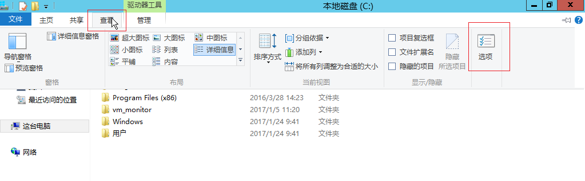
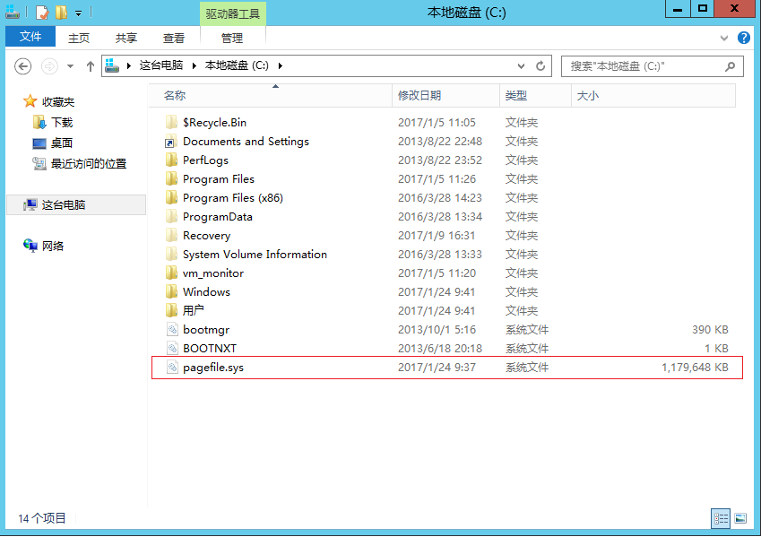
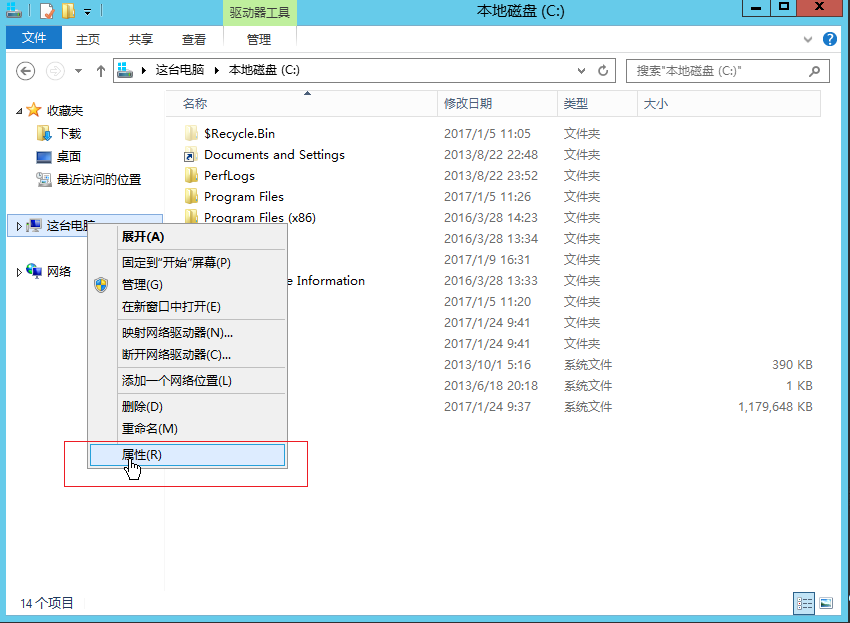
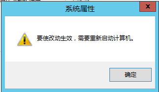

# 常见问题

## 访问云主机相关

* 怎么登陆到云主机内部？
  * 可以通过以下两种访问云主机，第一种是通过远程连接，第二种是通过VNC控制台进行登陆
* 远程连接就是通过，IP通常需要使用外网IP，如果没有绑定外网端口，可以使用VPN来通过云主机的私有网IP登陆，认证方式一般为密钥方式
  * VNC控制台方式就是直接云主机详情页面上点击“VNC”按钮，需要输入VNC密码进行登陆，另外需要注意VNC页面上的提示信息
* 为什么我无法通过VNC方式打开云主机终端窗口？
 * 首先请确认你使用的浏览器是IE10及以上版本，或者是较新版本的Chrome、firefox，其他浏览器的兼容性尚未测试，暂时无法保证
 * 如果你的浏览器符合要求，但仍然无法打开VNC窗口，请联系工单系统解决

## 虚拟内存相关

* 如何查看Windows云主机虚拟内存文件pagefile.sys？

虚拟内存文件通常是隐藏文件，需要先开启相关配置才能显示。以Windows Server 2012R2镜像创建的一台云主机为例：
首先点击文化夹【查看】中的【选项】

在打开的【文件加选项】中，取消勾选【隐藏受保护的操作系统文件（推荐）】，同时点选【显示隐藏的文件、文件夹和驱动器】

确定之后，即可在系统盘目录下查看到该文件及其大小

*如何修改Windows云主机虚拟内存的大小?
以Windows Server 2012R2镜像创建的一台云主机为例，右键点击【这台电脑】查看【属性】

在【系统】窗口中，点击【高级系统设置】

在【系统属性】的【高级】面板中，点击【性能】部分的【设置】按钮

点击【虚拟内存】部分的【更改】按钮

在【虚拟内存】的面板中，选择【自定义大小】，填入【初始大小】和【最大值】两个设置值，点击【设置】按钮，可以看到上面的【分页文件大小】已经变成了设定的范围。
点击【确定】后退出。

该改动需要重新启动计算机以使设置生效。

重启计算机后，利用上面的【查看Windows云主机虚拟内存文件】的方法，可以看到虚拟内存文件已经被限制在自定义范围内。

