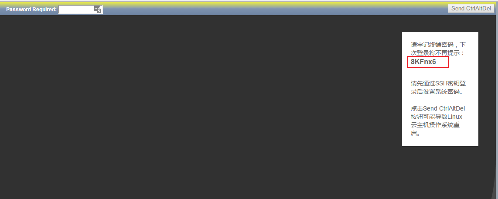
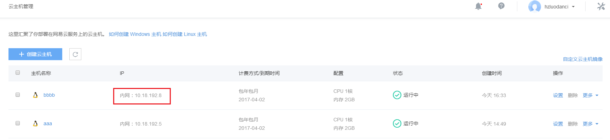

## 登录linux云主机

### 初次登录云主机

目前提供两种访问linux云主机的方式，第一种是通过SSH进行登录，第二种是通过VNC控制台进行登录。

####1.SSH方式

SSH方式就是通过SSH客户端工具，连接到云主机的IP地址和相应的端口进行登录，IP通常需要使用外网IP，如果没有绑定外网端口，可以使用蜂巢VPN来通过云主机的私有网IP登录，认证方式一般为密钥方式。

关于如何使用蜂巢VPN，请参考[如何使用蜂巢OpenVPN](http://support.c.163.com/md.html#!容器服务/服务管理/使用技巧/如何使用蜂巢 OpenVPN.md)

关于如何使用SSH密钥登录，请参考[如何使用SSH密钥登录](http://support.c.163.com/md.html#!容器服务/服务管理/使用技巧/如何使用 SSH 密钥登录.md)

Attention:
云主机默认登录用户名为root。

####2.VNC控制台方式

VNC控制台方式就是直接在产品管理员界面上选择云主机之后点击“更多”中的“VNC”按钮，需要输入云主机的用户名密码进行登录，请注意云主机默认屏蔽了用户名密码的登录方式，如果你需要使用VNC登录，请在ssh登录后，手工修改密码后再使用VNC控制台登录，另外需要注意VNC页面上的提示信息。VNC密码将在第一次VNC控制台方式登录的时候提示，下次登录将不再提示。

Attention:
如果要在VNC控制台通过用户名密码登录，需要先通过SSH密钥登录进云主机，设置用户名密码之后才可以使用。

* ssh方式需要网络支持才可以使用，VNC不需要网络支持也可以使用，你可以认为VNC就是云主机的显示器。

#### 以 Ubuntu 14.04 64位 镜像创建的一台云主机为例：

连接上用户VPN之后，可以使用云主机的内网IP，该IP可以在云主机页面上找到。如果绑定了外网IP可以使用外网IP

选择一款SSH终端，这里以Xshell5为例，

1、安装并运行 Xshell，点击「文件」-「新建」，在「连接」目录输入相关信息：

2、在「连接」-「用户身份验证」目录输入相关信息，用户名输入「root」：

3、点击「浏览」按钮，弹出「用户密钥」窗口。点击「导入」，选择并导入之前创建云主机的公钥对应的私钥，后续点击「确定」即可完成连接。

