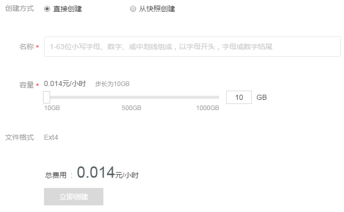
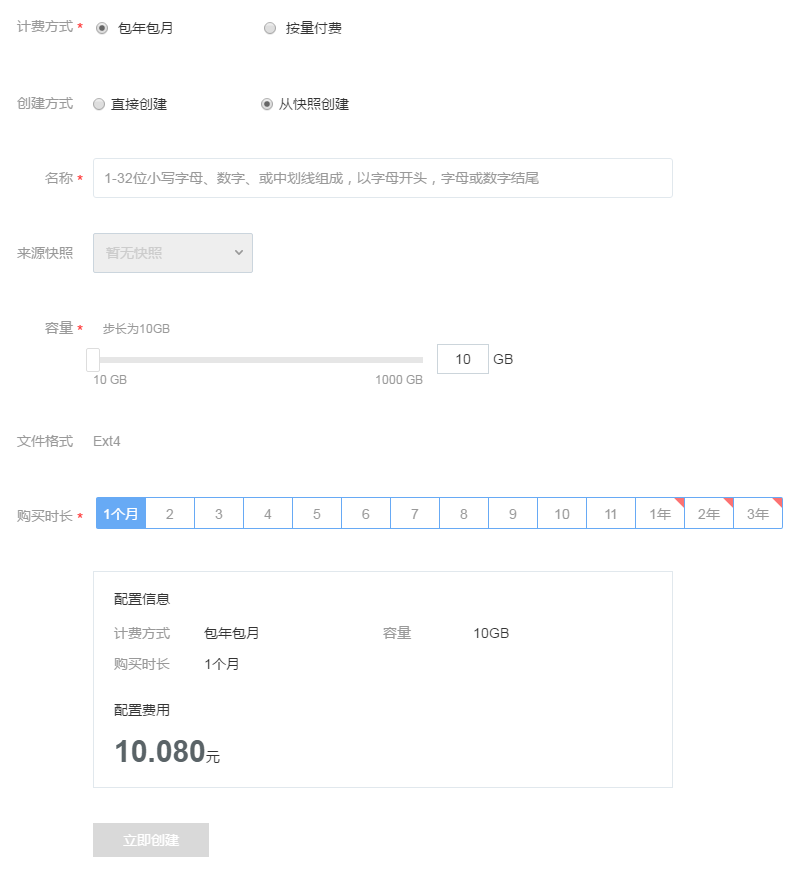

# 创建云硬盘

云硬盘有两种计费方式：包年包月和按量付费。建议你使用 [价格计算器](https://c.163.com/price) 对实例的价格成本进行初步估算，具体计费标准请参见 [云硬盘价格与计费](http://http://support.c.163.com/md.html#!平台服务/云硬盘/购买指南/云硬盘价格与计费.md)。

Note:
单个实例最多支持挂载 4 块高性能数据盘（SSD 云硬盘）；
每单云硬盘支持 10-1000 GB 容量，步长 10 GB。

Attention:
服务和云主机的云硬盘不通用，请注意选择；
面向云主机云硬盘，在云主机创建完成后挂载和管理；
面向服务云硬盘，需在创建服务时挂载，创建完成后无法再挂载额外云硬盘，请提前做好挂载数量规划。

## 操作流程

### 1. 直接创建

1.1. 登录 [控制台](https://c.163.com/dashboard#/m/volume/)，定位到「**云硬盘**」标签；
1.2. 点击云硬盘列表，左上角的「**创建云硬盘**」按钮；
1.3. 创建方式选择「**直接创建**」；
1.4. 选择「**适用范围**」；
1.5. 规划容量后创建：

### 2. 从快找创建

Note:
云主机目前不支持云硬盘快照；
从快找创建的云硬盘容量默认等于快照大小，你可以调整容量大于默认值。

2.1. 登录 [控制台](https://c.163.com/dashboard#/m/volume/)，定位到「**云硬盘**」标签；
2.2. 点击云硬盘列表，左上角的「**创建云硬盘**」按钮；
2.3. 创建方式选择「**从快照创建**」；
2.4. 选择「**适用范围**」（云主机目前不支持云硬盘快照）；
2.5. 规划容量后创建：

