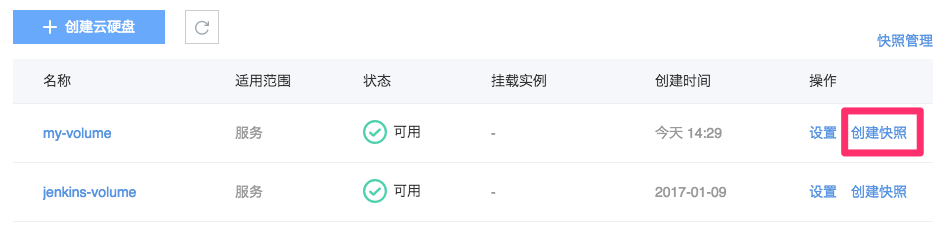
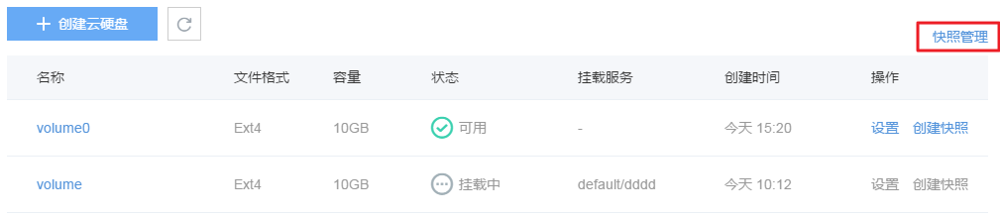
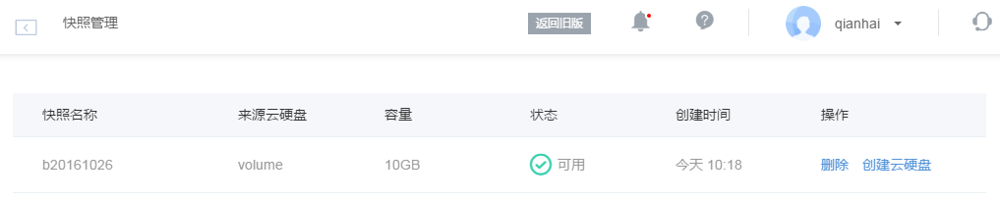

## 简介

云硬盘快照功能用于拷贝指定云硬盘内容。快照是独立于云硬盘生命周期的磁盘完全拷贝，不占用你的存储空间。快照支持在线实时备份，支持从快照创建云硬盘。目前快照服务免费，但每个云硬盘快照数量限制为 1。

## 创建快照

* 点击左侧的导航菜单「云硬盘」，进入云硬盘列表页，在右侧操作栏，点击「创建快照」
* 或在云硬盘列表页，点击相应云硬盘名称，进入云硬盘详情页，再点击「创建快照」按钮

* 只有「可用」状态的云硬盘可以创建快照；
* 目前快照服务免费，但每个云硬盘快照数量限制为 1。

## 快照管理

点击左侧的导航菜单「云硬盘」，进入云硬盘列表页，在右侧，点击「快照管理」

在快照管理页，你可以删除快照，或者使用对应快照创建云硬盘。

