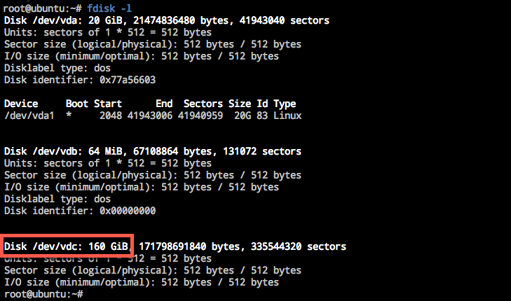
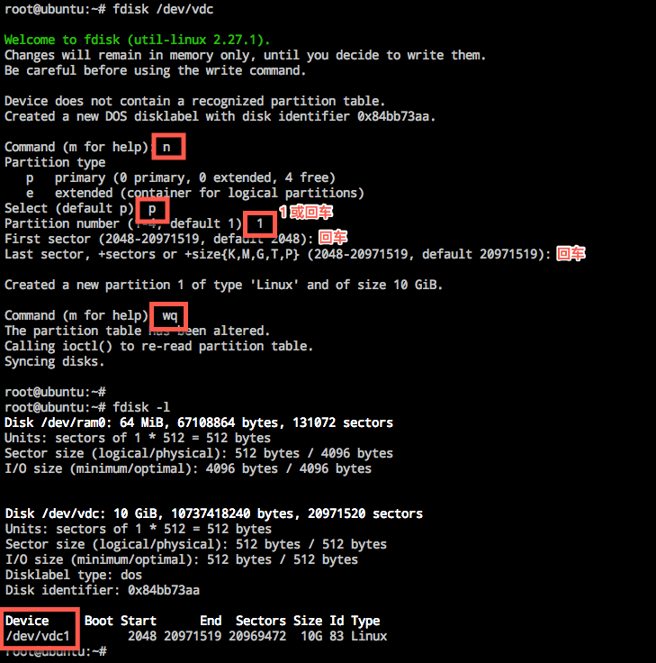
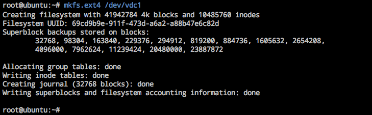
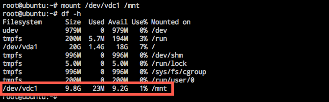

# Linux 云主机分区、格式化、挂载数据盘

在控制台创建和挂载云硬盘后，需要将数据盘格式化并挂载到云主机。

Attention:
格式化后数据将被清空，请确保数据盘中没有数据或已保留备份；
已格式化过的数据盘无需格式化，请跳转至「5. 挂载」直接 mount 后即可使用；
请勿对系统盘进行任何操作；
你可以按需对数据盘分区，建议使用系统自带工具 fdisk（本示例默认使用 MBR 分区表）。

## 操作步骤

适用于所有官方 Linux 镜像（CentOS/Ubuntu/Debian）创建的云主机。

### 1. 连接实例

使用 SSH 或 VNC 方式登录云主机，详请参见：[如何登录 Linux 云主机](http://support.c.163.com/md.html#!计算服务/云主机/使用指南/linux主机登录方法.md) 。

### 2. 确认已挂载的数据盘

使用如下命令查看已挂载的数据盘：

	fdisk -l

下方示例中可以看到刚挂载的数据盘 `/dev/vdc` 大小为 160 GB。以下内容都将以数据盘 `/dev/vdc` 作为示例。

### 3. （可选）分区

Note:
你也可以不分区直接格式化并创建文件系统，[如何查看分区信息](http://support.c.163.com/md.html#!平台服务/云硬盘/运维指南/Linux云主机/Linux云主机查看数据盘分区信息.md) ； 若需要多个分区，可以使用 man fdisk 参考 fdisk 其他用法。

使用如下命令对数据盘分区：

	fdisk {disk} #本示例中为 fdisk /dev/vdc 

根据提示，依次输入 **n**（新建分区）➡ **p**（新建扩展分区）➡ **2**（使用第 2 个主分区） ➡ 两次回车（使用默认配置）➡ 输入 **wq**（保存分区表）➡ 再回车开始分区。

### 4. 格式化并创建文件系统

Attention:
仅针对新创建的云硬盘，若数据盘已格式化过并存有数据，格式化之后将删除数据。若需要保留数据，请勿执行 mkfs，直接 mount 后即可使用。

使用如下命令对新分区格式化并创建文件系统：

	mkfs.{fstype} {device} #本示例中为 mkfs.ext4 /dev/vdc1

格式化时间取决于数据盘大小，也可以按需选择其他如 ext3 等文件格式（[如何查看分区的文件系统](http://support.c.163.com/md.html#!平台服务/云硬盘/运维指南/Linux云主机/Linux云主机查看分区文件系统.md) ）。

### 5. 挂载新分区

Note:
手动挂载数据盘的云主机重启后，挂载将失效；若需开机自动 mount 数据盘，则必须将分区信息写入 /etc/fastab 中，详见 [如何自动挂载数据盘](http://support.c.163.com/md.html#!平台服务/云硬盘/运维指南/Linux云主机/Linux云主机自动挂载数据盘.md) 。

使用如下命令将新分区挂载至云主机文件夹：

	mount {device} {dir} #本示例中为 mount /dev/vdc1 /mnt

使用 `df -h` 命令确认挂载成功：

