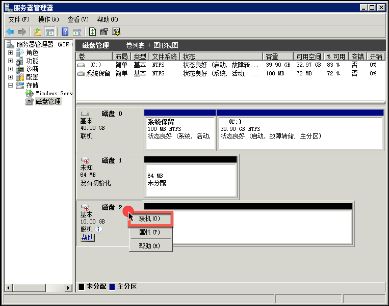
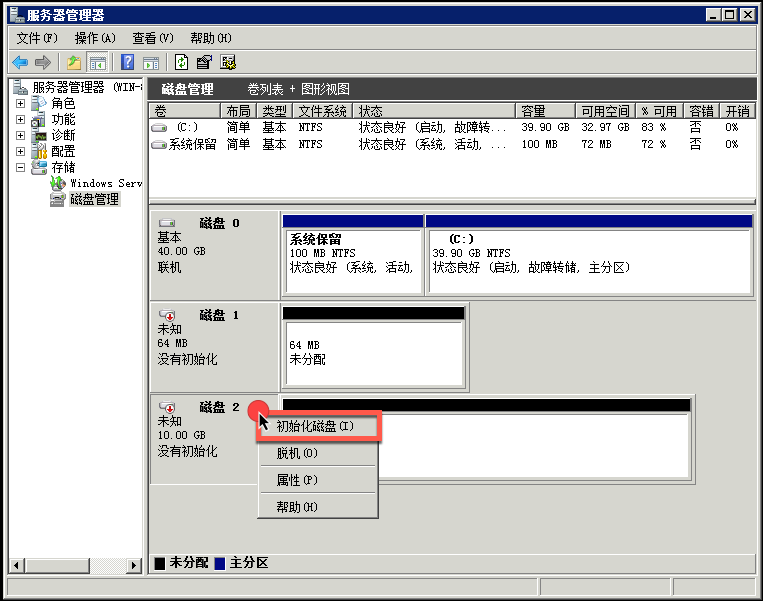
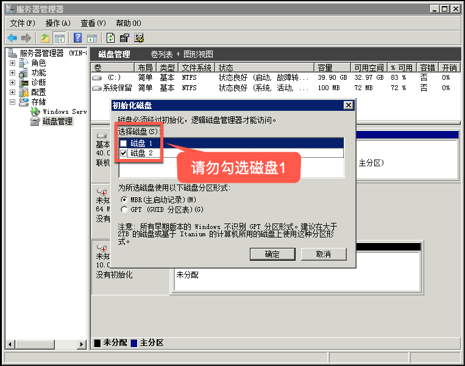
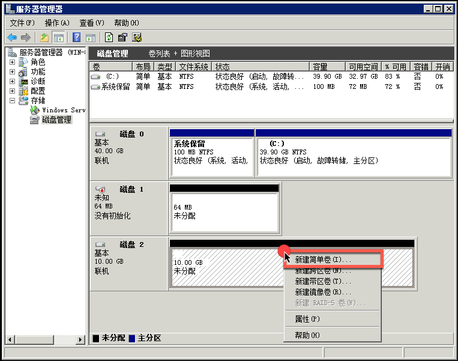
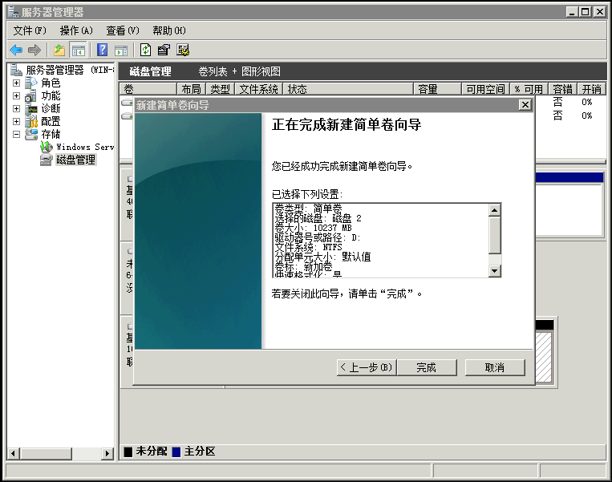
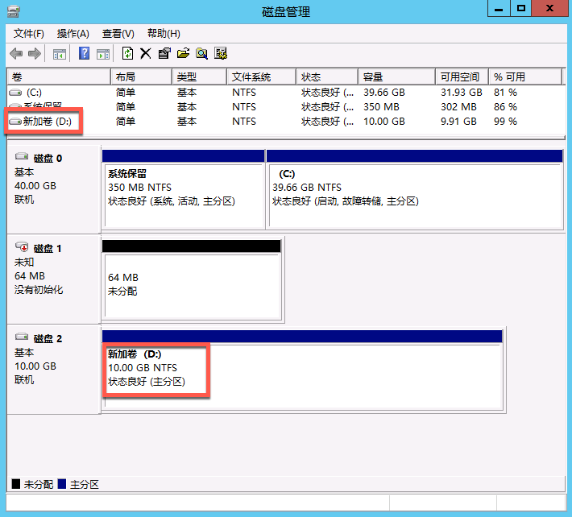

# WindowsServer2008 联机、分区、格式化

在控制台创建和挂载云硬盘后，需要将数据盘联机、分区和格式化。

Attention:
格式化后数据将被清空，请确保数据盘中没有数据或已保留备份；
已格式化过的数据盘无需格式化，直接联机后即可使用；
请勿对系统盘进行任何操作；
你可以按需对数据盘分区。

## 操作步骤

适用于官方 WindowsServer2008 镜像创建的云主机。

### 1. 连接实例

使用 **远程连接** 或 **VNC** 方式登录云主机，详请参见：[如何登录 Windows 云主机](http://support.c.163.com/md.html#!容器服务/云主机/使用指南/windows主机基本操作.md) 。

### 2. 打开磁盘管理

2.1. 点击任务栏「**服务器管理器**」；
2.2. 在弹出的页面，选择「**存储**」➡「**磁盘管理**」： 

Note:
打开磁盘管理时提示「初始化磁盘 - 磁盘1」，点击取消即可（磁盘 1 是 config drive 盘）。

### 3. 联机磁盘

Note:
若已处于联机状态则跳过该步骤。

定位到目标磁盘，**右键** 点击磁盘名，选择「**联机**」：

### 4. （可选）初始化磁盘

Attention:
仅针对新创建的云硬盘，若数据盘已格式化过并存有数据，格式化之后将删除数据。

4.1. 定位到目标磁盘，**右键** 点击磁盘名，选择「**初始化磁盘**」：

4.2. 勾选需要初始化的磁盘（**请勿**勾选磁盘 1），按需选择分区形式（MBR 最大支持 2 TB），点击确定：

### 5. 分区

5.1. **右键** 点击右侧未分配空间区域，选择「**新建简单卷**」：

Note:
我们建议选择简单卷，其他卷类型不提供技术支持。

5.2. 默认一直下一步即可（按需分配卷大小和驱动器号），点击 **完成** 开始格式化：

Note:
建议在一个盘格式化完成后，再初始化下一个数据盘，否则可能导致默认盘符冲突。

