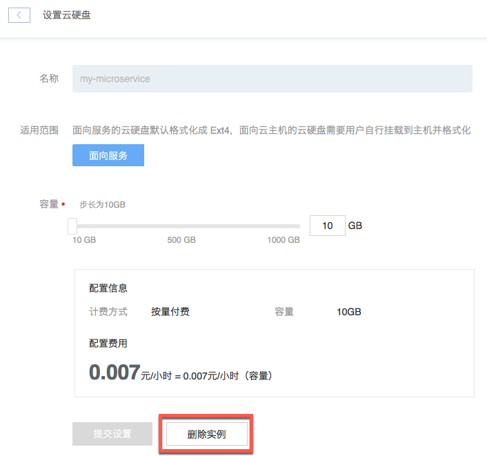

# 删除云硬盘

Note:
面向云主机的云硬盘，须解绑后才允许删除；
面向服务的云硬盘，须删除对应服务实例才允许删除；
删除后云硬盘后，资源将被释放，数据将被清除且不可恢复。

## 操作步骤

1. 登录 [控制台](https://c.163.com/dashboard#/m/volume/)，定位到目标实例；
2. 点击右侧的「**设置**」按钮；

3. 在设置云硬盘页面，点击「**删除实例**」即可：

## 相关 API

[API 手册 - 获取云硬盘列表](http://support.c.163.com/md.html#!平台服务/云硬盘/API 手册/获取云硬盘列表.md)
[API 手册 - 删除云硬盘](http://support.c.163.com/md.html#!平台服务/云硬盘/API 手册/删除云硬盘.md)
