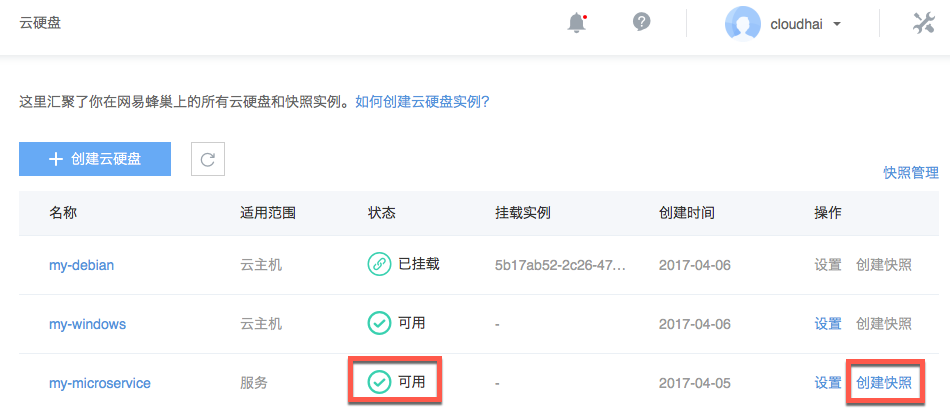

# 创建快照

云硬盘快照功能用于拷贝指定云硬盘内容，支持在线实时备份，支持从快照创建云硬盘。

Note:
面向云主机的云硬盘即将支持快照；
只有「可用」状态面向服务的云硬盘才可以创建快照；
快照是独立于云硬盘生命周期的磁盘完全拷贝，不占用你的存储空间；
目前快照服务免费，每个云硬盘快照数量限制为 1，后创建的快找将覆盖之前的快照。

## 操作步骤

Attention:
如对数据完整性有要求，在创建快照时，请暂停向该云硬盘的数据写入。

1. 登录 [控制台](https://c.163.com/dashboard#/m/volume/)，定位到目标实例；
2. 点击右侧的「**创建快照**」按钮：

