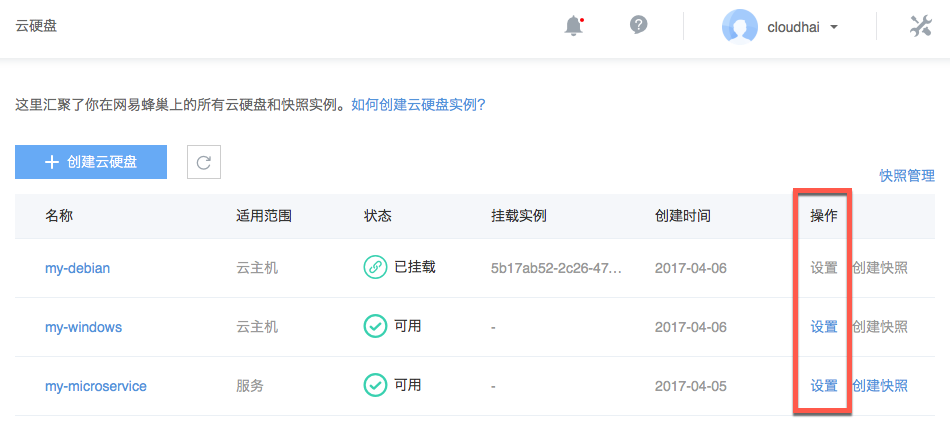
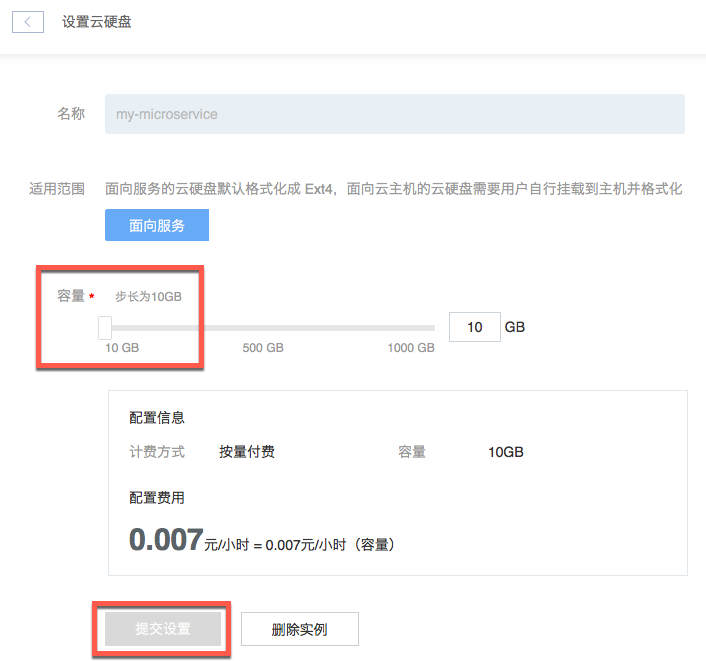

# 扩容云硬盘

Note:
1. 面向云主机的云硬盘，扩容后需要 [扩容文件系统](http://support.c.163.com/md.html#!平台服务/云硬盘/使用指南/扩容文件系统/扩容Linux云主机文件系统-GPT.md)，以便云主机可以使用扩容的空间； 2. 面向服务的云硬盘，扩容后将自动生效，无需手动扩容文件系统； 3. 扩容后容量必须大于当前容量； 4. 包年包月实例暂不支持扩容。

## 操作步骤

1. 登录 [控制台](https://c.163.com/dashboard#/m/volume/)，定位到目标实例；
2. 点击右侧的「**设置**」按钮；

3. 选择需要扩容的容量，点击「**提交设置**」即可：

## 相关 API

[API 手册 - 获取云硬盘列表](http://support.c.163.com/md.html#!平台服务/云硬盘/API 手册/获取云硬盘列表.md)
[API 手册 - 扩容云硬盘](http://support.c.163.com/md.html#!平台服务/云硬盘/API 手册/扩容云硬盘.md)