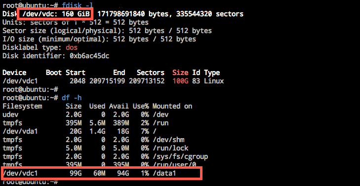
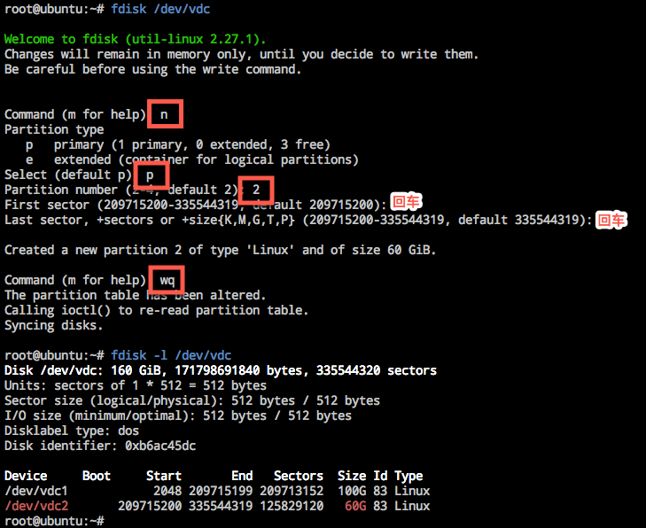
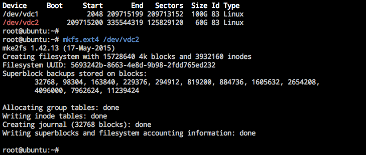
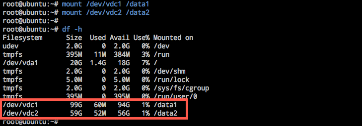
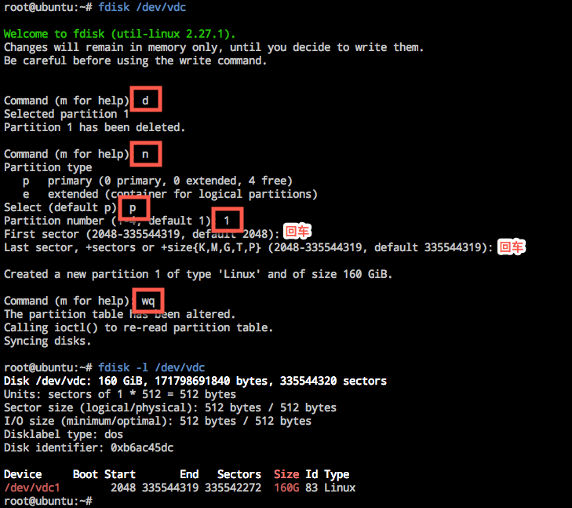
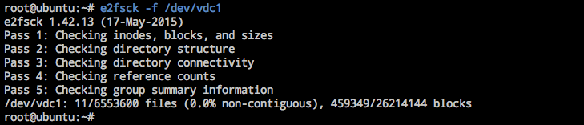
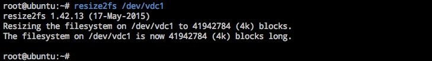
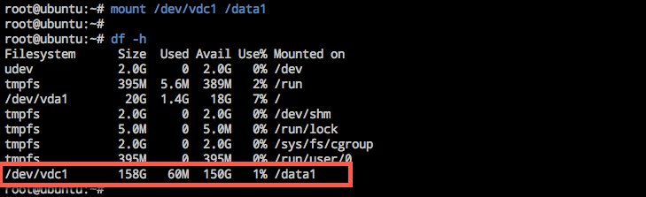

# 扩容 Linux 云主机文件系统

Note:
操作前，请确保已经对扩容了云硬盘，详见http://support.c.163.com/md.html#!平台服务/云硬盘/使用指南/扩容云硬盘.md

## 确认分区形式

根据 
确认分区形式 http://support.c.163.com/md.html#!平台服务/云硬盘/运维指南/Linux云主机/Linux云主机查看数据盘分区信息.md

## MBR 指引

### 1. 独立

#### 连接云主机

使用 SSH 或 VNC 方式登录云主机，详请参见：[如何登录 Linux 云主机](http://support.c.163.com/md.html#!容器服务/云主机/使用指南/linux主机登录方法.md) 。

#### 查看数据盘信息

使用如下命令查看已挂载的数据盘信息：

	fdisk -l
	df -h

下方示例中可以看到挂载数据盘 `/dev/vdc` 的信息：
* 容量：160 GB（扩容前 100 GB）
* 分区：`/dev/vdc1`（100 GB）
* 挂载点：`/data1`

以下内容都将以该数据盘 `/dev/vdc` 作为示例。

#### 卸载目标分区

使用如下命令卸载已挂载的目标分区：

	umount {dir} #示例中为 umount /data1

#### 数据盘分区

使用如下命令对数据盘扩容部分新建分区：

	fdisk {disk} #本示例中为 fdisk /dev/vdc 

根据提示，依次输入 **n**（新建分区）➡ **p**（新建扩展分区）➡ **2**（使用第 2 个主分区） ➡ 两次回车（使用默认配置）➡ 输入 **wq**（保存分区表）➡ 再回车开始分区。

#### 格式化并创建文件系统

使用如下命令对新分区格式化并创建文件系统：

	mkfs.{fstype} {device} #本示例中为 mkfs.ext4 /dev/vdc2

格式化时间取决于数据盘大小，也可以按需选择其他如 ext3 等文件格式（[如何查看分区的文件系统](http://support.c.163.com/md.html#!平台服务/云硬盘/运维指南/Linux云主机/Linux云主机查看分区文件系统.md) ）。

#### 挂载新分区

Note:
手动挂载数据盘的云主机重启后，挂载将失效；若需开机自动 mount 数据盘，则必须将分区信息写入 /etc/fastab 中，详见 [如何自动挂载数据盘](http://support.c.163.com/md.html#!平台服务/云硬盘/运维指南/Linux云主机/Linux云主机自动挂载数据盘.md) 。

使用如下命令将所有分区挂载至云主机文件夹：

	mount {device} {dir} #本示例中为 mount /dev/vdc1 /data1 和 mount /dev/vdc2 /data2

使用 `df -h` 命令确认挂载成功：

### 2. 扩容

#### 连接云主机

使用 SSH 或 VNC 方式登录云主机，详请参见：[如何登录 Linux 云主机](http://support.c.163.com/md.html#!容器服务/云主机/使用指南/linux主机登录方法.md) 。

#### 查看数据盘信息

使用如下命令查看已挂载的数据盘信息：

	fdisk -l
	df -h

下方示例中可以看到挂载数据盘 `/dev/vdc` 的信息：
* 容量：160 GB（扩容前 100 GB）
* 分区：`/dev/vdc1`（100 GB）
* 挂载点：`/data1`

以下内容都将以该数据盘 `/dev/vdc` 作为示例。

#### 卸载目标分区

使用如下命令卸载已挂载的目标分区：

	umount {dir} #示例中为 umount /data1

#### 删除原分区再新建分区

使用如下命令删除原分区：

	fdisk {disk} #本示例中为 fdisk /dev/vdc

根据提示，依次输入 **d**（删除分区）➡ **n**（新建分区）➡ **p**（新建扩展分区）➡ **2**（使用第 2 个主分区） ➡ 两次回车（使用默认配置）➡ 输入 **wq**（保存分区表）➡ 再回车开始分区。

#### 检查文件系统

使用如下命令检查扩容后分区的文件系统：

	e2fsck -f {device} #本示例中为 e2fsck -f /dev/vdc1

#### 扩容文件系统

使用如下命令扩容文件系统：

	resize2fs {device} #本示例中为 resize2fs /dev/vdc1

#### 挂载新分区

Note:
手动挂载数据盘的云主机重启后，挂载将失效；若需开机自动 mount 数据盘，则必须将分区信息写入 /etc/fastab 中，详见 [如何自动挂载数据盘](http://support.c.163.com/md.html#!平台服务/云硬盘/运维指南/Linux云主机/Linux云主机自动挂载数据盘.md) 。

使用如下命令将新分区挂载至云主机文件夹：

	mount {device} {dir} #本示例中为 mount /dev/vdc1 /data1

使用 `df -h` 命令确认挂载成功：

## GPT 指引

### 独立

umount /data1

fdisk -l /dev/vde

parted /dev/vde print

mkpart primary kaishi end # mkpart primary 100GB 100%

print

mkfs.ext3 /dev/vde2

mount /dev/vde1 /data1
mount /dev/vde2 /data2

### 扩容

umount /data1

fdisk -l /dev/vde

parted /dev/vde

rm 1
rm 2

mkpart primary kaishi end # mkpart primary 0 100%

e2fsck /dev/vde1 -f
resize2fs /dev/vde1

mount /dev/vde1 /data1

