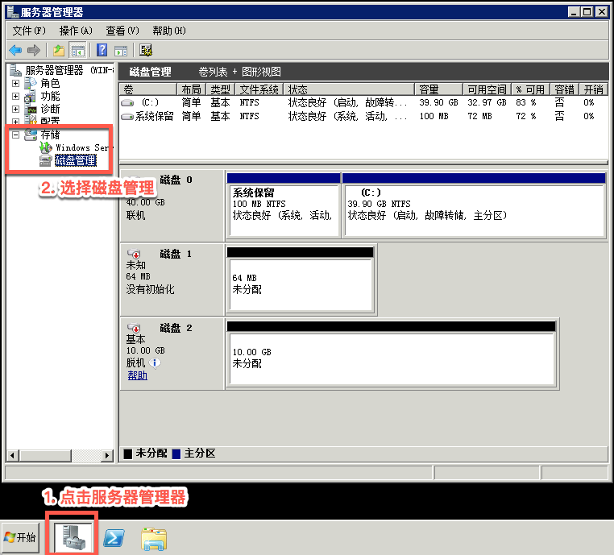
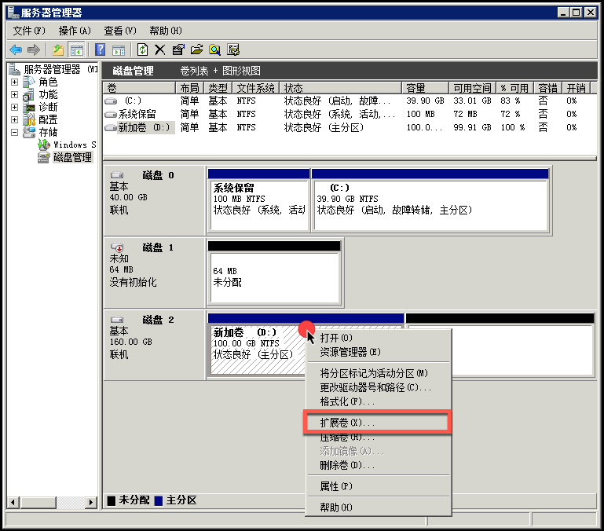
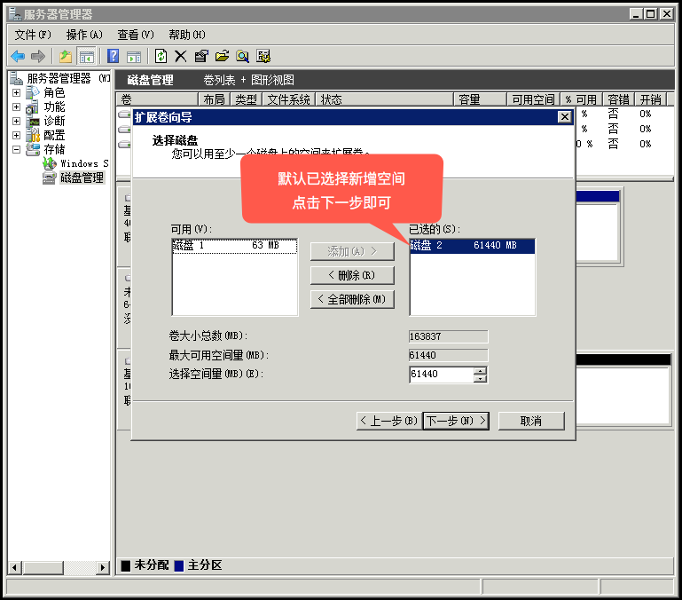
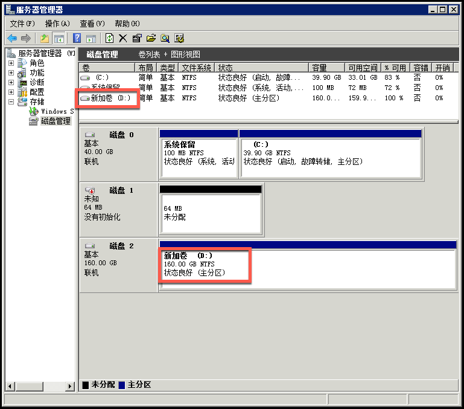
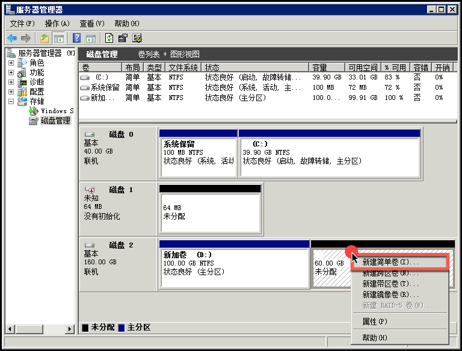
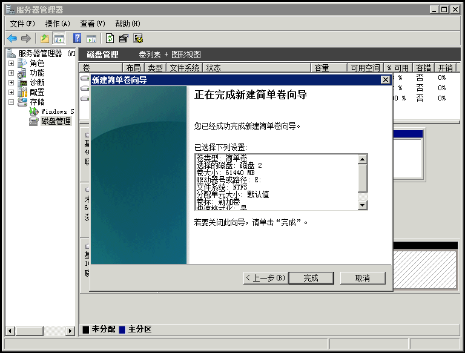
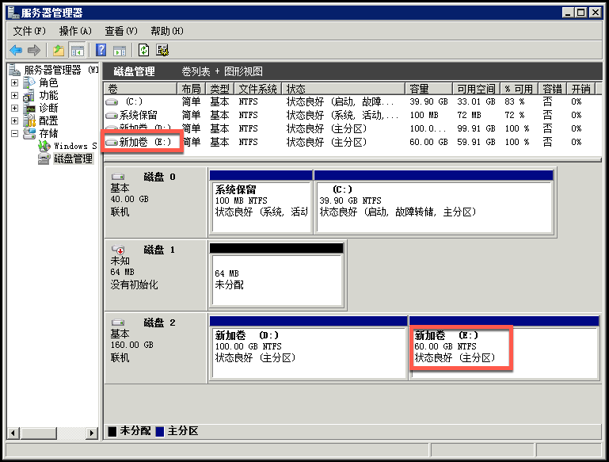

# 扩容 WindowsServer2008 云主机文件系统

Note:
1. 面向云主机的云硬盘，扩容后需要扩容文件系统，以便云主机可以使用扩容的空间； 2. 面向服务的云硬盘，扩容后将自动生效，无需手动扩容文件系统； 3. 操作前请确保已经扩容了云硬盘，详见 [扩容云硬盘](http://support.c.163.com/md.html#!平台服务/云硬盘/使用指南/扩容云硬盘.md)； 4. 以下指引在正常操作的情况下不会丢失数据； 5. 适用于蜂巢官方 WindowsServer2008 镜像创建的云主机。

## 操作步骤

### 1. 扩容原分区

#### 1.1. 连接实例

使用 **远程连接** 或 **VNC** 方式登录云主机，详请参见：[如何登录 Windows 云主机](http://support.c.163.com/md.html#!容器服务/云主机/使用指南/windows主机基本操作.md) 。

#### 1.2. 打开磁盘管理

**鼠标右键** 点击「**开始**」按钮，选择「**磁盘管理**」：

#### 1.3. 扩展卷

1.3.1. 定位到目标磁盘，**右键** 点击原分区，选择「**扩展卷**」：

1.3.2. 默认已选择新增的空间，直接点击 **下一步** 即可（不支持扩展不同的数据盘）：

1.3.3. 最后点击 **完成**，分区已扩容：

### 2. 新建分区

#### 2.1. 连接实例

使用 **远程连接** 或 **VNC** 方式登录云主机，详请参见：[如何登录 Windows 云主机](http://support.c.163.com/md.html#!容器服务/云主机/使用指南/windows主机基本操作.md) 。

#### 2.2. 打开磁盘管理

**鼠标右键** 点击「**开始**」按钮，选择「**磁盘管理**」：

Note:
打开磁盘管理时提示「初始化磁盘 - 磁盘1」，点击取消即可（磁盘 1 是 config drive 盘）。

#### 2.3. 分区

2.3.1. **右键** 点击右侧未分配空间区域，选择「**新建简单卷**」：

Note:
我们建议选择简单卷，其他卷类型不提供技术支持。

2.3.2. 默认一直下一步即可（按需分配卷大小和驱动器号），点击 **完成** 开始格式化：

