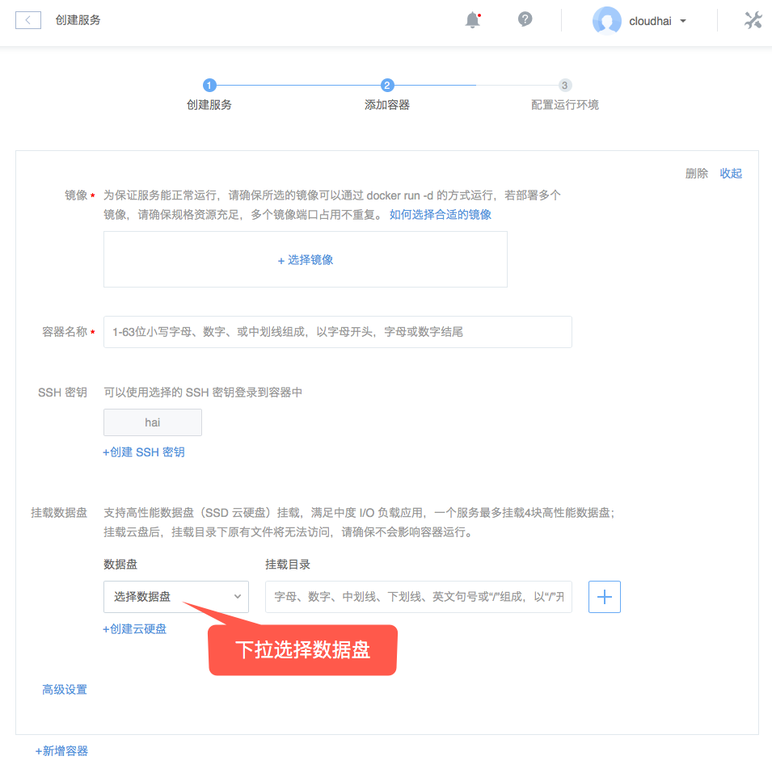

# 挂载云硬盘

Note:
单个实例最多支持挂载 4 块高性能数据盘（SSD 云硬盘）；
同一时刻，一块云盘只能挂载到一个实例上，不支持挂载到多个实例上；
数据盘 UUID 和系统磁盘对应关系详见云硬盘常见问题。

Attention:
面向云主机的云硬盘，在云主机创建完成后挂载和管理；
面向服务的云硬盘，必须在创建服务时挂载，创建完成后无法再挂载额外云硬盘（支持扩容），请提前做好挂载数量规划。

## 操作步骤

### 1. 服务挂载云硬盘

在创建有状态服务时（只有有状态服务支持挂载数据盘），选择挂载的数据盘和挂载目录，详见：[创建有状态服务](http://support.c.163.com/md.html#!容器服务/服务管理/使用指南/创建有状态服务.md) 。

### 2. 云主机挂载云硬盘

1.1. 登录 [控制台](https://c.163.com/dashboard#/m/win/)，定位到目标云主机实例；
1.2. 点击实例名称，进入「**云主机详情页**」；
1.3. 在「**云硬盘信息**」下，点击右侧的「**挂载云硬盘**」按钮；
1.4. 选择需要挂载的数据盘，点击确定即可：

