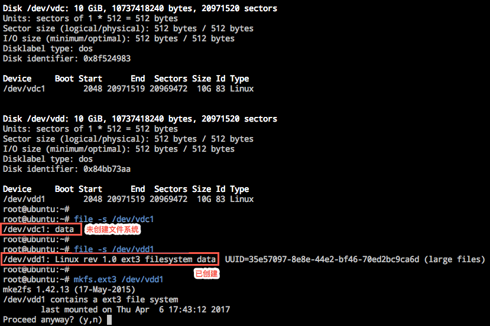

# Linux 云主机查看分区文件系统

Note:
你可以根据分区是否创建文件系统，来确认是否需要格式化数据盘。

使用如下命令查看分区文件系统：

	file -s {device} #示例中为 file -s /dev/vdc1

根据输出结果判断：

* 若仅为 `data` 则说明该分区未创建文件系统（示例中为：`/dev/vdc1: data`）；
* 若包含 `filesystem` 则说明该分区已经创建了文件系统（示例中为：`/dev/vdd1: Linux rev 1.0 ext3 filesystem data`）。

