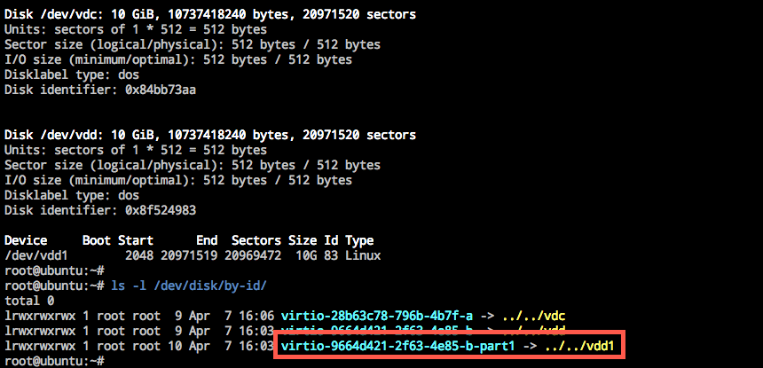
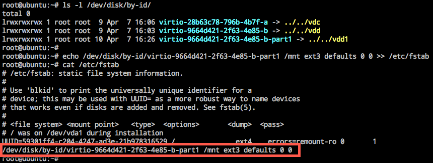
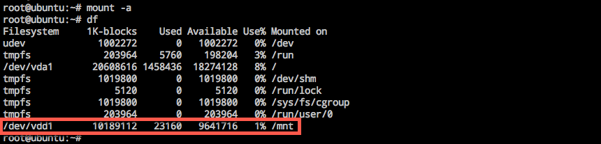

# Linux 云主机自动挂载数据盘

手动 mount 数据盘的云主机重启后，挂载将失效；若需开机自动 mount 数据盘，则必须将分区信息写入 /etc/fastab 中（/etc/fstab 说明详见 man fstab）。本文档以 Ubuntu 16.04 为例，也适用于其他 Linux 系统。

Note:
设备名称可能会随着挂载卸载操作而变化，文件系统 UUID 在重新格式化文件系统后也会发生变化，从而导致自动挂载设置失效。我们推荐使用数据盘软连接 /disk/by-id。

## 操作步骤

### 1. 获取 /disk/by-id

使用如下命令获取 by-id：

	ls -l /dev/disk/by-id/

### 2. 备份 /etc/fstab

 	cp /etc/fstab /etc/fstab.backup

### 3. 写入 /etc/fstab

使用如下命令将挂载信息写入 `/etc/fstab`

	echo {by-id} {dir} {type} {options} {dump} {pass} >> /etc/fstab 
	#本示例中为 echo /dev/disk/by-id/virtio-9664d421-2f63-4e85-b-part1 /mnt ext3 defaults 0 0 >> /etc/fstab

### 4. 验证

运行 `mount -a` 命令挂载，若无异常返回则说明文件正常，自动挂载成功。

