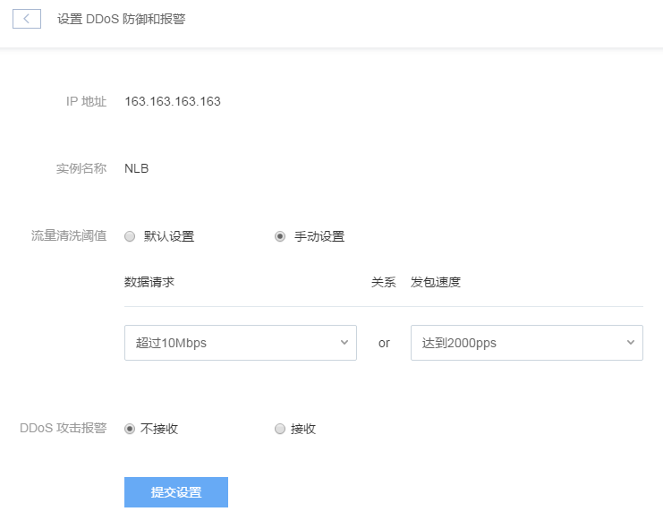

# 设置 DDoS 防御和报警

点击左侧的导航菜单「安全服务」，进入安全范围页面，在「流入流出监控」标签内选择需要设置的对应模块，再点击右侧的「设置」按钮：

Note:
安全服务仅监控使用了公网的模块

进入设置 DDoS 防御和报警页面后，即可设置流量清洗阈值和报警：

* 流量清洗阈值支持根据攻击规模**或**发包速度设定；
* 选择某项数据请求后，将自动生成发包速度推荐值（支持再次自定义）。
Attention:
若不了解流量清洗阈值的合理范围，建议使用默认设置即可。

