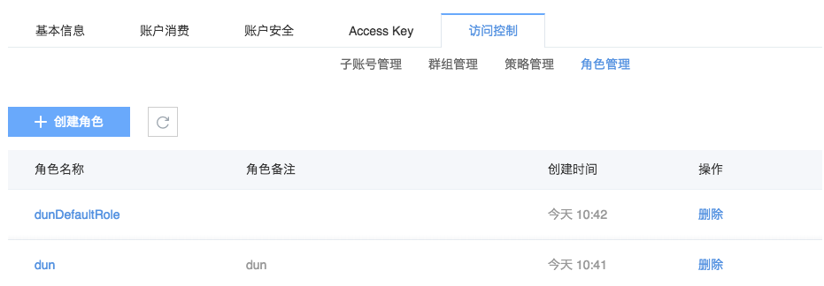

# 角色

目前提供服务角色，主要用于授权云服务代理您进行资源操作。目前支持的受信服务：易盾反垃圾。

## 创建角色

详见 [易盾反垃圾服务接入](http://support.c.163.com/md.html#!平台服务/对象存储/反垃圾服务接入.md)。

## 管理角色

支持在角色管理页面删除角色（已经受信的服务删除角色后，将停止服务。若需要再次开通，需要重新授信）。点击对应角色名称后，进入角色详情页，支持：

* 基本信息：修改角色备注；
* 策略管理：查看策略

