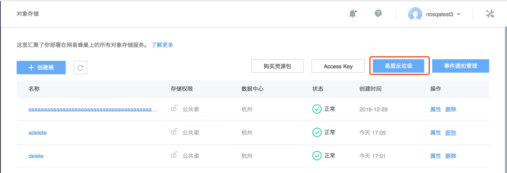
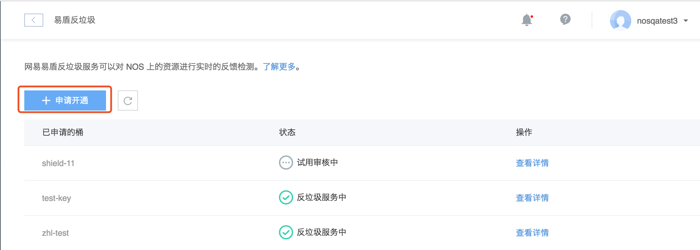
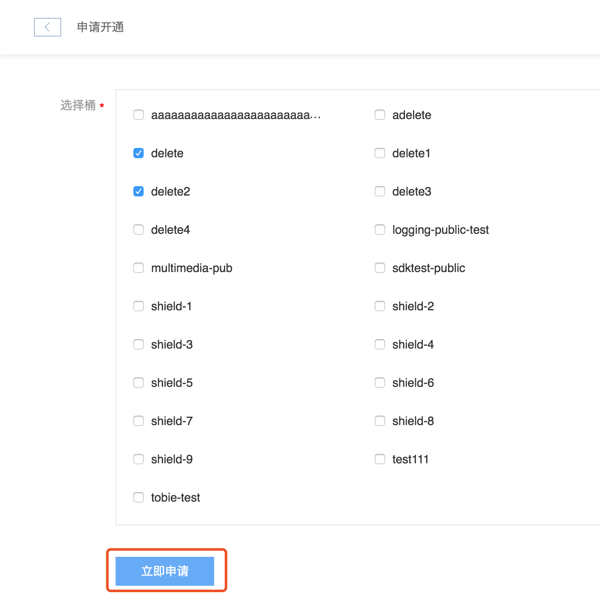
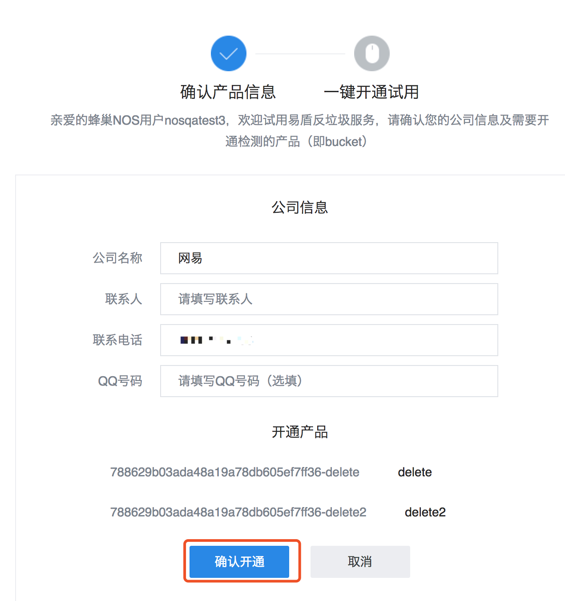
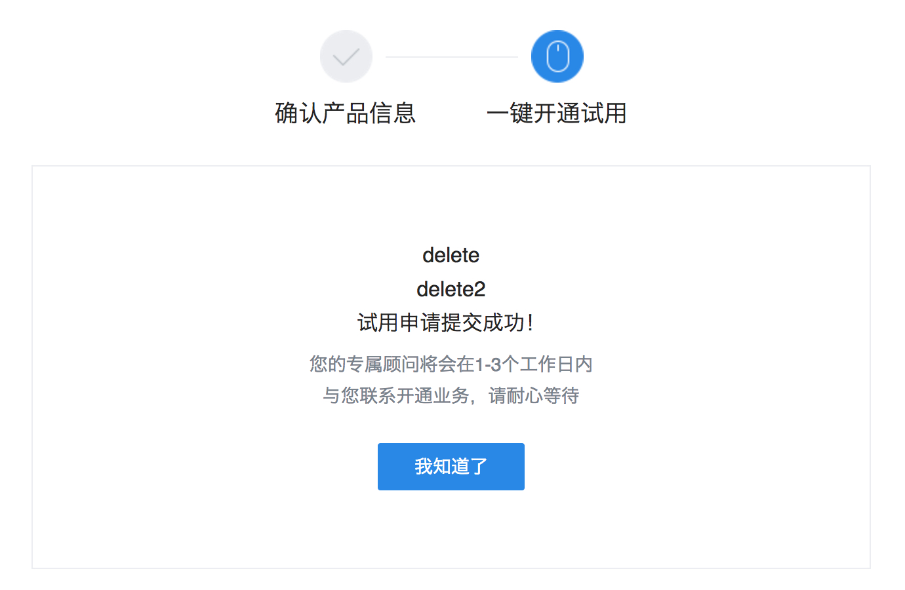

# 反垃圾服务接入

## 介绍
网易易盾NOS反垃圾服务基于人工智能、大数据分析技术，依托网易反垃圾海量特征样本库，对用户存储在NOS上的图片或视频等数据进行高效甄别，并对涉及广告、色情、违禁、暴恐等垃圾类型进行嫌疑程度的判断，实时反馈检测结果。同时为用户提供准确便捷的检测结果展示平台，用户可通过结果变更、删除等快捷操作，对图片或视频等数据做出快速处理，帮助企业减少审核人力成本，有效降低运营风险。

## 接入流程
某个用户开通了NOS服务，进入桶概览页面

点击”易盾反垃圾”，可以进入易盾反垃圾界面

Attention:
如果之前没有开通”访问控制”，需要手动开通 [访问控制](http://support.c.163.com/md.html#!平台服务/安全服务/访问控制使用指南/访问控制快速入门.md)

在该界面会显示已经开通的产品状态，同时如果没有开通产品，可以点击”申请开通”，会显示可以开通的桶列表（目前只支持公开桶）

可以选择单个桶也可以批量选择桶，点击”立即开通”，进入产品确认界面：

补充完产品信息后，点击”确认开通”，进入开通界面：

之后会经过人工审核可以正常使用反垃圾功能。

