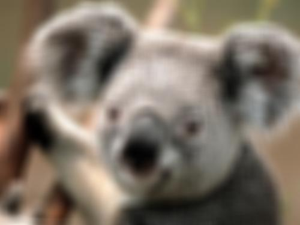
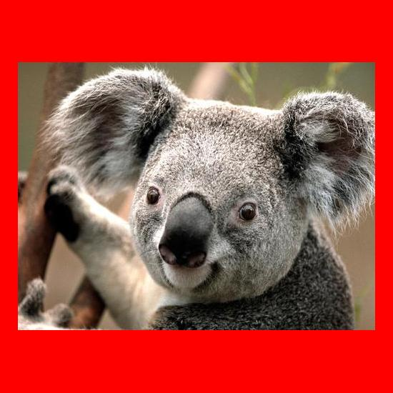

# 图片效果

### **高斯模糊**

#### **描述**
使用高斯噪声对图片进行模糊化

#### **接口**

    GET /${ObjectKey}?imageView&blur=${radius}x${sigma} 
    HTTP/1.1

#### **参数**

|**名称**|	            **描述**                	|**取值范围**|
|--------|------------------------------------------|------------|
|blur	 |高斯模糊关键字                            |            |	
|radius	 |高斯模糊半径(像素)，不包含中心点的像素	|1~50        |
|sigma	 |高斯模糊标准差	                        |大于或等于0 |
#### **示例**
效果图：http://img-sample.nos-eastchina1.126.net/Koala.jpg?imageView&blur=10x20

### **图片填充**

#### **描述**
使用指定颜色对图片背景色进行填充

#### **接口**

    GET /${ObjectKey}?imageView&pad=${width}_${height}_${color} 
    HTTP/1.1

### **参数**
|**名称**|	                       **描述**                        	|       **取值范围**        |
|--------|----------------------------------------------------------|---------------------------|
|pad	 |填充关键字                                                |                           |	
|width	 |填充后图片的宽度，0代表宽度取原图的大小	                |0或者大于原图宽的值        |
|height	 |填充后图片的高度，0代表高度取原图的大小	                |0或者大于原图宽的值        |
|color	 |填充的颜色，颜色经过URL安全的Base64编码，RGB格式，可以是颜色名称（比如red）或十六进制（比如#FF0000）缺省为白色(white)	                                    |0或者大于原图宽的值        |
#### **示例**
效果图：http://img-sample.nos-eastchina1.126.net/Koala.jpg?imageView&pad=550_550_cmVk

