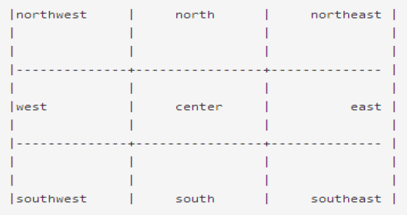

# 图片水印

### **基本介绍**

#### **描述**
水印操作可以在图片上设置另外一张图片或者文字做为水印。水印类型分成图片水印和文字水印

#### **接口**

    GET /${ObjectKey}?watermark 
    HTTP/1.1

#### **参数**
|  **名称**  |	                           **描述**                              |**是否必须**|
|------------|-------------------------------------------------------------------|------------|
|watermark	 |水印操作标志	                                                     |是          |
|type	     |水印类型，1代表图片水印，2代表文字水印	                         |是          |
|gravity	 |水印位置，详细见水印位置参数表，默认为：SouthEast	                 |否          |
|dissolve	 |水印透明度,取值为1-100，默认为100（完全不透明）	                 |否          |
|dx	         |横轴边距，单位:像素(px)，缺省值为10	                             |否          |
|dy	         |竖轴边距，单位:像素(px)，缺省值为10	                             |否          |
|stripmeta	 |是否去除元数据，1表示去除，0表示保留，默认为去除	                 |否          |
#### **水印位置**

* 其中靠边的Gravity其对应dx,dy起点为对应边，如 NorthWest，NorthEast，SouthWest，SouthEast 其对应的原点为四个顶点，向内延伸为正。
* 非靠边点，则以该模块和水印对象的中心点为原点，对应左右上下延伸分别为正负。
dx,dy原点对应九宫格里位置如下:

| **Gravity** |       	**dx对应原点**        |	         **dy对应原点**          |	        **备注**           |
|-------------|-------------------------------|----------------------------------|-----------------------------|
|northwest	  |纵轴左侧0列，向右延伸为正	  |横轴最顶部0行，向下延伸为正	     |dx,dy为0时，水印位于左上角   |
|north	      |纵轴中心轴为水印部分纵轴中心中轴所在轴，向右延伸为正|横轴最顶部行，向下延伸为正|dx,dy为0时水印位于顶部居中|
|northeast	  |纵轴最右侧列，向左延伸为正	  |横轴最顶部行，向下延伸为正	     |dx,dy为0时，水印位于右上角   |
|west	      |纵轴最左侧列，向右延伸为正	  |横轴居中行为水印部分横轴中心轴所在轴，向下延伸为正|	dx,dy为0时，水印位于左侧居中|
|center	|纵轴中心轴为水印部分纵轴中心中轴所在列，向右延伸为正|	横轴居中行为水印部分横轴中心轴所在轴，向下延伸为正	|dx,dy为0时，水印位于上下左右居中|
|east|	纵轴最右侧列，向左延伸为正|	横轴居中行为水印部分横轴中心轴所在轴，向下延伸为正	|dx,dy为0时，水印位于右侧居中|
|southwest|	纵轴最右侧列，向左延伸为正|	横轴居中行为水印部分横轴中心轴所在轴，向下延伸为正|	dx,dy为0时，水印位于右侧居中|
|south|	纵轴中心轴为水印部分纵轴中心中轴所在轴，向右延伸为正	|横轴最底部0行，向上延伸为正|	dx,dy为0时，水印位于底部居中|
|southeast|	纵轴最右侧列，向左延伸为正	|横轴最底部0行，向上延伸为正	|dx,dy为0时，水印位于底部居中|
### **图片水印**

#### **请求query**
watermark&type=2&text=${text}&font=${font}&fontsize=${fontsize}&fontcolor=${color}&gravity=${gravity}&dissolve=${dissolve}&dx=${distanceX}&dy=${distanceY}

#### **参数**
|**名称**|	                             **描述**                                 |**是否必须**|
|--------|------------------------------------------------------------------------|------------|
|image	 |图片水印logo的object名字（经过URL安全的Base64编码）。Logo图片必须位于同一bucket下且存在，且边长不得超过4096	|是|
#### **示例**
效果图：

http://img-sample.nos-eastchina1.126.net/Koala2.jpg?watermark&type=1&dissolve=80&quality=100&gravity=north&image=Y2FydG9vbl9sb2dvLnBuZw==

### **文字水印**

#### **请求query**
watermark&type=2&text=${text}&font=${font}&fontsize=${fontsize}&fontcolor=${color}&gravity=${gravity}&dissolve=${dissolve}&dx=${distanceX}&dy=${distanceY}

#### **参数**
| **名称** |	                                  **描述**                                     |**是否必须**|
|----------|-----------------------------------------------------------------------------------|------------|
|text	   |水印文字内容（经过URL安全的Base64编码）	                                           |是          |
|font	   |水印文字字体（经过URL安全的Base64编码），缺省为黑体.注意：中文水印必须指定中文字体。|	否      |
|fontsize  |水印文字大小，单位: 缇，等于1/20磅，默认大小为250，参考DPI为72,范围[20,+..]	  |否|
|fontcolor |水印文字颜色(经过URL安全的Base64编码)，RGB格式，可以是颜色名称（比如red）或十六进制（比如#FF0000）,缺省为白色(white)|否         |
#### **水印字体**
中文字体

|**参数**|	  **字体文件**     |	   **字体**       |
|--------|---------------------|----------------------|
|simfang |simfang.ttf|	仿宋|
|simhei|	simhei.ttf|	黑体|
|simkai|	simkai.ttf|	楷体|
|simsum|	simsun.ttc|	宋体|
|msyh|	msyh.ttf|	微软雅黑|
|msyhbd|	msyhdb.ttf|	微软雅黑(粗体)|
其它字体

|**参数**|	**字体文件**  |
|--------|----------------|
|arial|	arial.ttf|
|comic|	comic.ttf|
|couri|	couri.ttf|
|georgia|	georgia.ttf|
|impact|	impact.ttf|
|times|	times.ttf|
|trebuc|	trebuc.ttf|
|verdana|	verdana.ttf|
#### **示例**
效果图：http://img-sample.nos-eastchina1.126.net/Koala2.jpg?watermark&type=2&text=Tk9TIOmdoOiwsQ==&fontsize=2500&fontcolor=cmVk&dissolve=30&gravity=north
