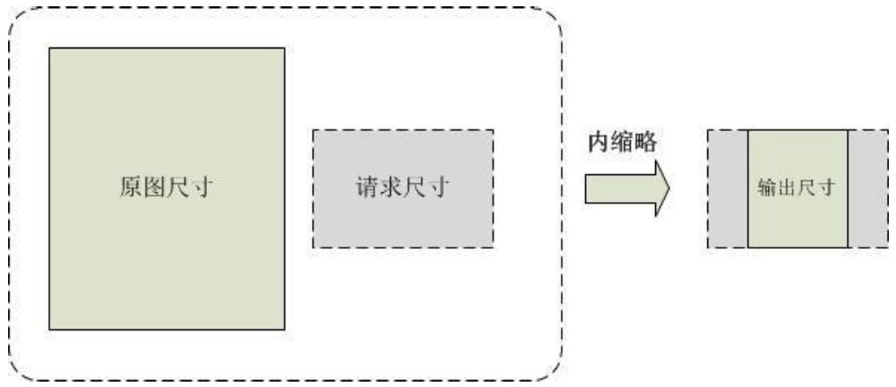
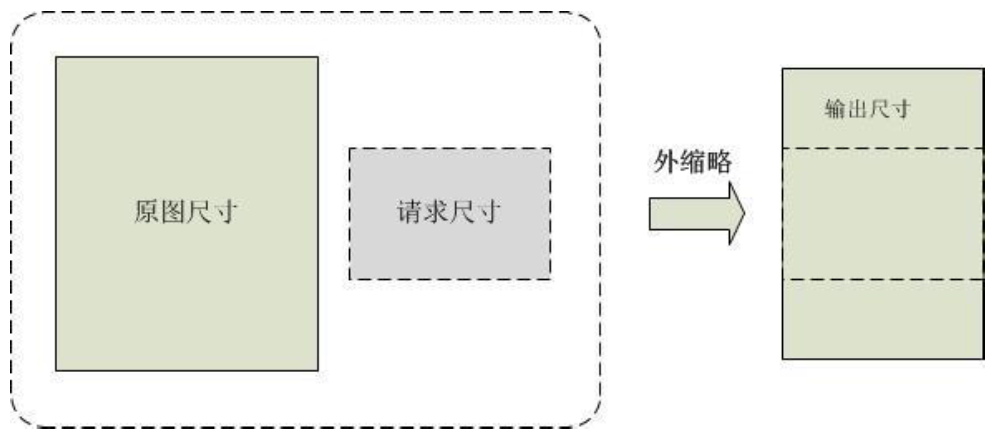
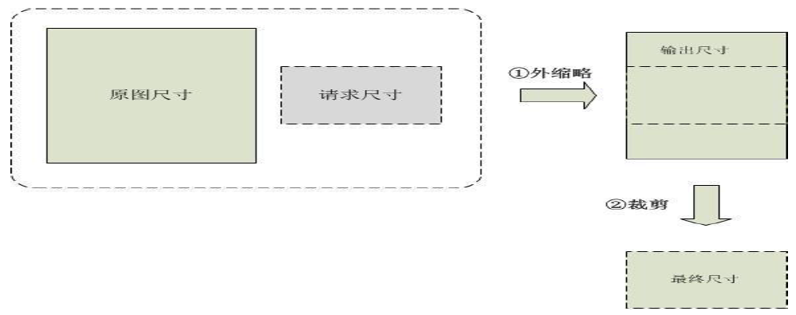
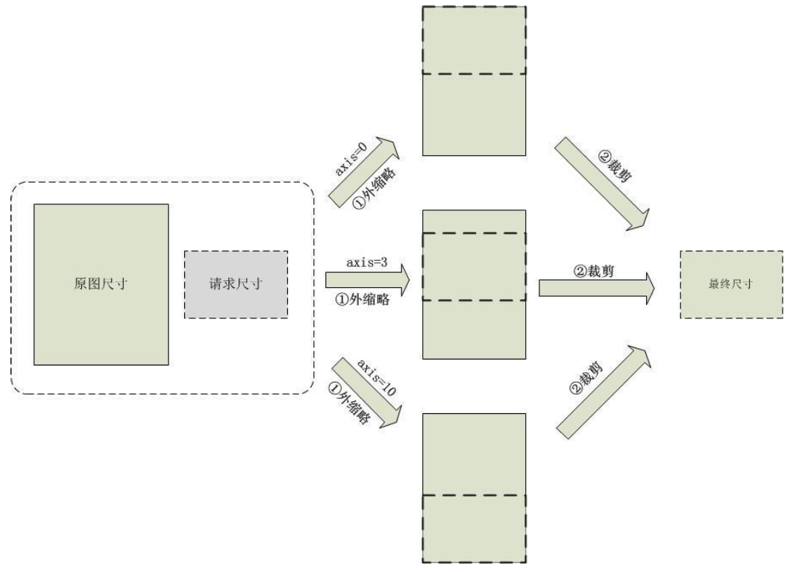
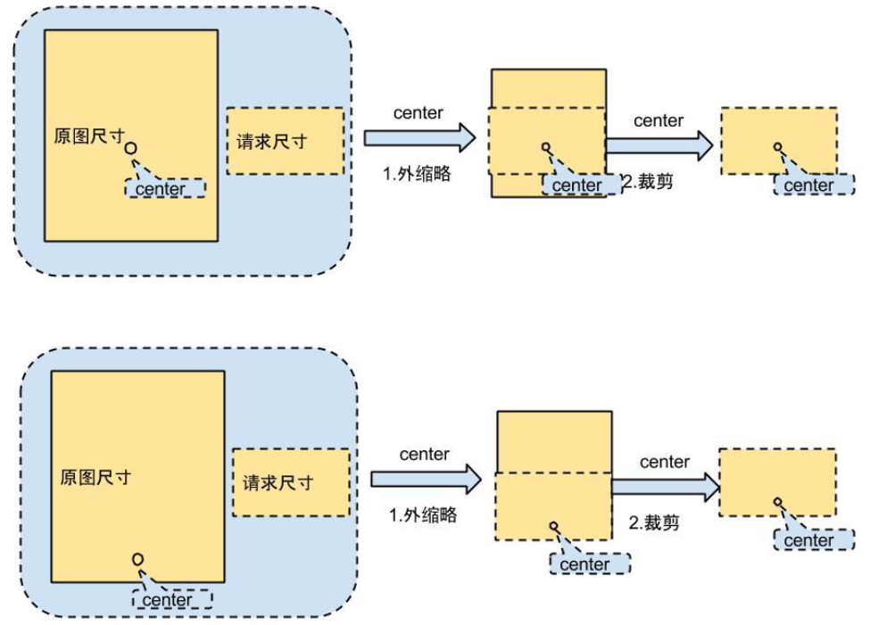

# 图片缩略

### **基于像素的图片缩略**

#### **描述**
按照图像像素对图片进行等比例缩略

#### **参数**
|**名称**|	                       **描述**                          |   
|--------|-----------------------------------------------------------|
|pixel	 |指定缩略图的最终像素，NOS将图片缩略为指定像素大小，如果原图像素小于指定像素，则返回原图                                                               |
#### **示例**
原图：http:// img-sample.nos-eastchina1.126.net/Koala.jpg

效果图：http:// img-sample.nos-eastchina1.126.net/Koala.jpg?imageView&pixel=40000

### **基于长宽的图片缩放**

#### **描述**
thumbnail 指定缩略图片的宽和高，有以下几种格式：

* WidthxHeight：普通缩略（内缩略）
* Widthx0：限定宽度，高度自适应（内缩略）
* 0xHeight：限定高度，宽度自适应（内缩略）
* WidthyHeight：裁剪缩略
* WidthzHeight：普通大边缩略（外缩略）
* 对于形如 Widthx0 和 0xHeight 的格式，表示限定图片的一边，另一边自适应。
例如：480x0，表示固定宽度为 480，高度自适应。 取值范围：0-4096，原则上返回的长宽不超过 4096，若放大后计算结果大于 4096，返回参数错误。

| **名称** 	|                                  **描述**                                    |**是否必须**|
|-----------|------------------------------------------------------------------------------|------------|
|imageView	|                               图片操作的关键字	                           |      是    |
|thumbnail	|                             图片长宽缩略的关键字	                           |      是    |
|axis       |该参数只针对裁剪缩略，axis表示裁剪得到的小图在缩略图中的位置。值定义方式为axis=x_y。其中x,y取值范围：0-10, 0表示y最顶端(x最左端)，10表示y最底端（x最右端）默认值：x,y均为5                    |      否    |
|center     |该参数只针对裁剪缩略，center将决定裁剪得到小图在缩略图中的位置。值的定义方式为center=x_y,其中x,y为原图上的坐标，裁剪缩略后的结果将尽量以该位置所在的点为中心，若遇到超过边界点，则以最近边界点为原点向内延伸。x,y的取值必需落于原图内。注意:当指定了center时，axis参数自动失效。另该参数无法支持imageView中以&为分隔符的链式处理，如需链式处理，需使用以“｜”为分隔符的管道操作取代                                         |      否    |
|enlarge    |该参数用于控制是否支持图片变大功能，1为支持变大，0为否，默认为否	           |      否    |
|tostatic   |该参数用于控制是否将动态图片缩略成静态图片，1为是，0为否，默认为是(注意该参数只支持缩略x,z操作)。另该参数无法支持imageView中以&为分隔符的链式处理，如需链式处理，需使用以“｜”为分隔符的管道操作取代|       否     |

#### **内缩略**

原图等比例缩略，缩略后的图片“一边等于请求长度，另一边小于等于请求长度”

|**参数**|	               **描述**                  |
|--------|-------------------------------------------|
|100x100 |固定宽和高等比例缩略                       |
|100x0	 |固定宽等比例缩略(保证图片宽度是100)        |
|0x100	 |固定高等比例缩略(保证图片高度是100)        |

#### **外缩略**

原图等比例缩略，缩略后的图片“一边等于请求长度，另一边大于等于请求长度”

|         **参数**         |        	**描述**              |
|--------------------------|----------------------------------|
|         100z100          |        	 外缩略               |

#### **裁剪缩略**
裁剪缩略可以看作分两步进行，先对图片进行外缩略，再对超出请求长度的部分进行裁剪。

|         **参数**           |                            **描述**                              |
|----------------------------|------------------------------------------------------------------|
|         100y100	         |                   裁剪缩略，超出部分进行裁剪                     |

下面的示例图表明了axis参数对裁剪缩略最终得到图片的影响：

下图为center参数对裁剪缩略最终图片的影响：

#### **示例**
内缩略:

http://img-sample.nos-eastchina1.126.net/Koala.jpg?imageView&thumbnail=200x200

外缩略:

http://img-sample.nos-eastchina1.126.net/Koala.jpg?imageView&thumbnail=200z200

裁剪缩略:

http://img-sample.nos-eastchina1.126.net/Koala.jpg?imageView&thumbnail=200y200

放大裁剪缩略:

http://img-sample.nos-eastchina1.126.net/Koala.jpg?imageView&thumbnail=2000y2000&enlarge=1
